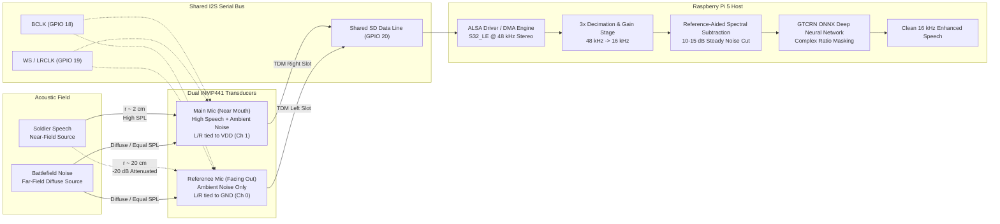
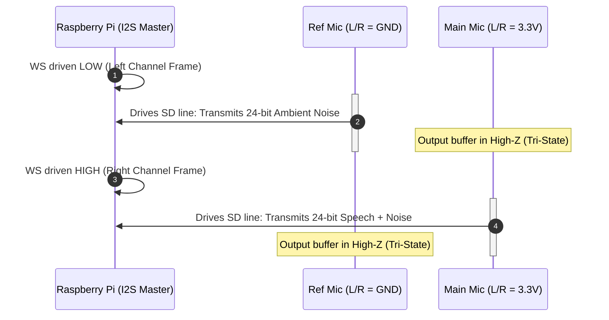

# Dual INMP441 MEMS Microphone Subsystem: Architecture, I2S Interfacing, and Pre-Neural Noise Cancellation

This document provides an exhaustive technical specification of the dual INMP441 MEMS microphone hardware subsystem, the Inter-IC Sound (I2S) digital protocol implementation, acoustic placement geometry, and the reference-guided spectral subtraction pre-filtering stage utilized in the defence speech enhancement pipeline.

---

## 1. System Overview & Engineering Rationale

In extreme battlefield, tactical, and industrial environments, acoustic sound pressure levels (SPL) regularly exceed 100 to 130 dB SPL. Such environments feature high-energy continuous background noise (tank diesel engines, helicopter turboshaft rotors, armored personnel carrier cabin resonance) overlaid with severe, unpredictable non-stationary transients (gunshots, artillery detonations, shrapnel impacts).

Under such extreme acoustic conditions, single-microphone speech enhancement architectures face fundamental mathematical limitations:
1. **Blind Noise Estimation Ambiguity:** A single acoustic transducer captures only the linear superposition $y[n] = s[n] + d[n]$ (speech plus noise). Decomposing this mixture without a separate noise observation requires statistical heuristics or deep neural priors that can falter during rapid noise shifts or low Signal-to-Noise Ratios (SNR < -5 dB).
2. **Harmonic Cancellation & Speech Distortion:** Aggressive neural suppression on low-SNR single-channel inputs often induces severe phonemic distortion, clipping high-frequency fricatives and muffling voice formants.
3. **Impulsive Noise Masking:** Non-stationary shockwaves lack temporal recurrence, blinding single-channel recursive algorithms.

To resolve these limitations, this system integrates an **acoustic dual-microphone array** utilizing two **INMP441 omnidirectional MEMS transducers**:
- **Main Microphone (Mouth / Near-Field):** Positioned directly in front of the speaker's lips to capture high-intensity vocal acoustic energy along with ambient noise.
- **Reference Microphone (Ambient / Far-Field):** Positioned away from the speaker, facing the open acoustic environment, to sample the prevailing ambient noise field with minimal vocal leakage.



By coupling physical spatial isolation with classical spectral subtraction prior to neural inference, the pre-stage removes **10 to 15 dB** of background noise. Consequently, the downstream **GTCRN (Grouped Temporal Convolutional Recurrent Network)** operates on an already partially sanitized signal, focusing its 23.7K parameters exclusively on non-linear residual artifacts, phase reconstruction, and transient suppression.

---

## 2. INMP441 Microphone Specifications

The **INMP441** (originally manufactured by InvenSense / TDK) is a high-performance, low-power, digital-output omnidirectional MEMS microphone with a bottom port. The sensor consists of a MEMS acoustic sensor element and an integrated conditioning ASIC containing an analog-to-digital converter (ADC), decimation filters, and a true I2S digital interface.

```
       +-------------------------------------------------------+
       |                     INMP441 ASIC                      |
       |                                                       |
       |  +------------+    +------------+    +-------------+  |
       |  | MEMS Audio |    | Preamplifier|   | 24-bit      |  |
       |  | Transducer |--->| & Low-Noise |--->| Sigma-Delta |--+
       |  | (Bottom)   |    | Buffer     |    | ADC         |  |
       |  +------------+    +------------+    +-------------+  |
       |                                             |         |
       |                                      Decimated Data   |
       |                                             v         |
       |  +------------+    +------------+    +-------------+  |
       |  | I2S Timing |<---| SCK (BCLK) |    | I2S Serial  |  |
       |  | Logic      |<---| WS (LRCLK) |    | Transmit    |---> SD (Data)
       |  | & L/R Pin  |<---| L/R Select |    | Buffer      |  |
       |  +------------+    +------------+    +-------------+  |
       +-------------------------------------------------------+
```

### Detailed Parametric Specifications

| Parameter | Specification | Engineering Significance |
| :--- | :--- | :--- |
| **Transducer Type** | Capacitive MEMS | Extreme vibration resistance; solid-state reliability |
| **Digital Interface** | Direct I2S (Inter-IC Sound) | Eliminates external ADCs, analog preamp drift, and EMI noise |
| **Output Data Format** | 24-bit 2's complement audio | Transmitted within a standard 32-bit serial slot (`S32_LE`) |
| **Native Sample Rate ($f_s$)**| 48 kHz (typical operating rate) | Wide ultrasonic/audio band; downsampled to 16 kHz for inference |
| **Sensitivity** | $-26\text{ dBFS} \pm 1\text{ dB}$ at $1\text{ kHz}, 94\text{ dB SPL}$ | High digital sensitivity ensures strong signal level without analog gain |
| **Signal-to-Noise Ratio (SNR)**| $61\text{ dB(A)}$ | Low self-noise floor; captures quiet voice whispers cleanly |
| **Acoustic Overload Point (AOP)**| $120\text{ dB SPL}$ (at 10% THD) | Resists saturation and hard clipping under intense shouting or nearby blasts |
| **Polar Pattern** | Omnidirectional | Uniform frequency pickup; relies on physical positioning for directivity |
| **Frequency Response** | $60\text{ Hz} \text{ to } 15\text{ kHz}$ | Covers fundamental human pitch ($85\text{--}255\text{ Hz}$) and upper speech formants |
| **Operating Voltage ($V_{DD}$)**| $1.8\text{ V to } 3.3\text{ V}$ | Directly compatible with Raspberry Pi 3.3V logic rails |
| **Current Consumption** | $\sim 1.4\text{ mA}$ per microphone | Negligible power draw (~2.8 mA combined); suitable for battery packs |
| **Power Supply Rejection (PSRR)**| $-75\text{ dBFS}$ ($217\text{ Hz}$ square wave) | High immunity to digital switching noise and RF power rail ripple |
| **Output Impedance State** | High-Z (Tri-State) inactive slot | Enables multiple microphones to share the same physical serial data line |
| **Breakout Dimensions** | $\approx 10\text{ mm} \times 15\text{ mm}$ | Compact form factor easily fitted into tactical headsets or tactical helmets |

> [!NOTE]
> The bottom-port acoustic hole requires that the PCB's bottom entry aperture remains unobstructed. In field enclosures, an acoustic mesh (hydrophobic and oleophobic ePTFE acoustic membrane) is installed over the port to block dust, humidity, and ballistic grit while transmitting acoustic energy with less than 0.5 dB insertion loss.

---

## 3. I2S Protocol Explained

The **Inter-IC Sound (I2S)** protocol is a synchronous serial communication bus standard developed by Philips Semiconductors (now NXP) specifically for digital audio data transfer between integrated circuits.

Unlike asynchronous protocols (such as UART) or master/slave packet protocols (such as SPI or I2C), I2S separates clocking signals from data lines to completely eliminate clock jitter-induced phase errors.

### The 3-Wire Bus Signals

1. **BCLK / SCK (Continuous Serial Bit Clock):**
   - Synchronizes individual bit transmissions. Every audio bit sent on the data line is clocked out on the falling edge of BCLK and sampled by the receiver on the rising edge.
   - Frequency calculation:
     $$f_{\text{BCLK}} = f_s \times N_{\text{bits}} \times N_{\text{channels}}$$
     For a 48 kHz sampling rate with 32-bit slots across a stereo (2-channel) configuration:
     $$f_{\text{BCLK}} = 48{,}000\text{ Hz} \times 32\text{ bits} \times 2 = 3{,}072{,}000\text{ Hz} = 3.072\text{ MHz}$$

2. **WS / LRCLK (Word Select / Left-Right Clock):**
   - Defines channel boundaries and indicates whether the currently transmitting slot belongs to Channel 0 (Left) or Channel 1 (Right).
   - Frequency: Exact audio sample rate ($f_{\text{WS}} = f_s = 48\text{ kHz}$).
   - Logic polarity in standard I2S:
     - **$\text{WS} = \text{LOW } (0)$:** Left Channel transmission.
     - **$\text{WS} = \text{HIGH } (1)$:** Right Channel transmission.
   - Note: In standard I2S, the MSB of the audio word is driven onto the data line **one BCLK cycle after** the WS transition.

3. **SD / SDATA (Serial Data):**
   - Transmits audio data bits sequentially, Most Significant Bit (MSB) first.
   - The INMP441 outputs 24 bits of valid audio data followed by 8 bits of zero-padding within a 32-bit slot.

```
WS (LRCLK)
    ----+                               +-------------------------------+
        |   LEFT CHANNEL (WS = LOW)     |    RIGHT CHANNEL (WS = HIGH)  |
        +-------------------------------+                               +----
BCLK (SCK)
        _   _   _   _   _   _   _   _   _   _   _   _   _   _   _   _   _
      _| |_| |_| |_| |_| |_| |_| |_| |_| |_| |_| |_| |_| |_| |_| |_| |_| |_
SD (SDATA)
      --+-------+-------+-------+-------+-------+-------+-------+-------+----
        | 1-bit | Bit23 | Bit22 | Bit21 | 1-bit | Bit23 | Bit22 | Bit21 |
        | Delay | (MSB) |       |       | Delay | (MSB) |       |       |
      --+-------+-------+-------+-------+-------+-------+-------+-------+----
        ^ Reference Mic Transmits       ^ Main Mic Transmits
          (L/R tied to GND)               (L/R tied to VDD)
          Main Mic in High-Z              Reference Mic in High-Z
```

### Time-Division Multiplexing (TDM) & High-Z Bus Sharing

A critical capability of the INMP441 is its tri-state output driver controlled by the **L/R (Left/Right select)** pin:

- **When $\text{L/R} = \text{GND}$:** The microphone is assigned to the **Left Channel**. It actively drives the `SD` line only when $\text{WS} = \text{LOW}$. As soon as $\text{WS}$ transitions to $\text{HIGH}$, the microphone tri-states its `SD` pin into a High-Impedance ($\text{High-Z}$) state, electrically disconnecting itself from the wire.
- **When $\text{L/R} = V_{DD}$ ($3.3\text{ V}$):** The microphone is assigned to the **Right Channel**. During $\text{WS} = \text{LOW}$, its output buffer remains in $\text{High-Z}$. When $\text{WS}$ switches to $\text{HIGH}$, it asserts control of the line and transmits its 24-bit sample.



Because of this hardware-level Time-Division Multiplexing, **both microphones share the exact same physical SD data wire, SCK bit clock wire, and WS word select wire**. No external multiplexer, switcher, or additional GPIO pins are required.

---

## 4. Hardware Wiring & Pin Connections

The Raspberry Pi 5 (and Raspberry Pi 4B) contains an internal hardware I2S peripheral exposed across specific pins on the standard 40-pin GPIO header.

### Comprehensive Pinout & Interfacing Matrix

| INMP441 Pin Name | Main Mic (Mouth) Connection | Reference Mic (Ambient) Connection | Raspberry Pi 40-Pin Header | BCM GPIO / Function | Electrical Description |
| :--- | :--- | :--- | :--- | :--- | :--- |
| **VDD** | Pin 1 ($3.3\text{ V}$) | Pin 1 ($3.3\text{ V}$) | **Physical Pin 1** | $3.3\text{ V}$ Rail | Regulated DC Power ($1.8\text{ V} \text{ to } 3.3\text{ V}$, ~2.8 mA total) |
| **GND** | Pin 6 ($\text{GND}$) | Pin 6 ($\text{GND}$) | **Physical Pin 6 / 9 / 14** | Ground Reference | Common ground plane return |
| **SCK / BCLK** | Pin 12 | Pin 12 | **Physical Pin 12** | **GPIO 18 (PCM_CLK)** | Serial Continuous Bit Clock ($3.072\text{ MHz}$) |
| **WS / LRCLK** | Pin 35 | Pin 35 | **Physical Pin 35** | **GPIO 19 (PCM_FS)** | Word Select / Frame Sync ($48\text{ kHz}$) |
| **SD / SDATA** | Pin 38 | Pin 38 | **Physical Pin 38** | **GPIO 20 (PCM_DIN)** | Serial Audio Data Ingest |
| **L/R (Select)** | **Tied to VDD (3.3V)** | **Tied to GND** | Local PCB Jumpers | — | Hardware channel configuration:<br>• Main $\to \text{Right}$ (Ch 1)<br>• Ref $\to \text{Left}$ (Ch 0) |

> [!IMPORTANT]
> The INMP441 is strictly a 3.3V logic device. **Never connect VDD to 5V (Physical Pin 2 or 4)**, as this will immediately destroy the MEMS ASIC. Furthermore, keep wire lead lengths below $15\text{ cm}$ (6 inches); high-speed 3.072 MHz clock lines are susceptible to capacitive loading and ground bounce if unshielded ribbon cables are used.

```
       Raspberry Pi 40-Pin Header
       +---------------------------------------------+
       | [ 1] 3.3V  o-----+-----------------------+  |
       | [ 2] 5.0V  o     |                       |  |
       | [ 6] GND   o--+--|--------------------+  |  |
       | [12] GP18  o--|--|--+--------------+  |  |  |
       |               |  |  | (BCLK)       |  |  |  |
       | [35] GP19  o--|--|--|--+--------+  |  |  |  |
       |               |  |  |  | (WS)   |  |  |  |  |
       | [38] GP20  o--|--|--|--|--+--+  |  |  |  |  |
       +---------------|--|--|--|--|--|--|--|--|--|--+
                       |  |  |  |  |  |  |  |  |  |
                       |  |  |  |  |  |  |  |  |  |
            +----------+  |  |  |  |  |  |  |  |  |
            |             |  |  |  |  |  |  |  |  |
      +-----v-----+       |  |  |  |  |  |  |  |  |       +-----------+
      |  INMP441  |       |  |  |  |  |  |  |  |  |       |  INMP441  |
      | (Ref Mic) |       |  |  |  |  |  |  |  |  |       |(Main Mic) |
      |           |       |  |  |  |  |  |  |  |  |       |           |
      |   VDD <---+-------+--|--|--|--|--|--|--|--+-----> | VDD       |
      |   GND <---+----------+--|--|--|--|--+--|--------> | GND       |
      |   SCK <-----------------+--|--|--|-----+--------> | SCK       |
      |    WS <--------------------+--|--|--------------->| WS        |
      |    SD <-----------------------+--+---------------> | SD        |
      |   L/R <---+ (To GND = Left/Ch0)        (To 3.3V) +-> L/R       |
      +-----------+                                       +-----------+
```

### Raspberry Pi OS Kernel Configuration

To enable the hardware I2S capture controller, the kernel device tree must bind the Broadcom I2S PCM interface to an ALSA audio card definition.

Edit `/boot/firmware/config.txt` (or `/boot/config.txt` on older OS versions) with superuser privileges:

```ini
# Enable hardware I2S / PCM interface
dtparam=i2s=on

# Load standard I2S capture overlay (e.g., Google VoiceHAT or generic simple-audio-card)
dtoverlay=googlevoicehat-soundcard
```

After modifying the configuration, reboot the board:
```bash
sudo reboot
```

### Driver & ALSA Hardware Verification

Once rebooted, verify that ALSA registers the I2S microphone hardware as a valid capture card:

```bash
# List all ALSA capture devices
arecord -l
```

Expected output confirms the card binding:
```text
**** List of CAPTURE Hardware Devices ****
card 1: sndrpigooglevoi [snd_rpi_googlevoicehat_soundcar], device 0: Google voiceHAT SoundCard HiFi voicehat-hifi-0 [Google voiceHAT SoundCard HiFi voicehat-hifi-0]
  Subdevices: 1/1
  Subdevice #0: subdevice #0
```

To test raw capture directly at native 48 kHz stereo 32-bit resolution:
```bash
arecord -D plughw:1,0 -c 2 -r 48000 -f S32_LE -d 5 test_dual_mic.wav
```

Inspect the recorded file using `sox` or Python `soundfile`:
```bash
python3 -c "import soundfile as sf; d, fs = sf.read('test_dual_mic.wav'); print('Shape:', d.shape, 'Sample rate:', fs)"
# Expected Output: Shape: (240000, 2) Sample rate: 48000
```

---

## 5. Channel Assignment & Audio Stream Ingestion

### Hardware Channel Mapping

Channel decoding is fixed by the physical wiring of the `L/R` strapping pin:

| Channel Number | ALSA / Software Name | Physical Mic Assignment | Electrical Strap | Acoustic Source |
| :---: | :---: | :---: | :---: | :---: |
| **Channel 0** | **Left Channel** | **Reference Microphone** | Pin strapped to **GND** | Diffuse ambient noise (no close speech) |
| **Channel 1** | **Right Channel** | **Main Microphone** | Pin strapped to **$3.3\text{ V}$** | Speaker's voice + ambient noise |

### Software Ingestion Pipeline (`live_demo.py`)

Inside the streaming audio engine [`scripts/live_demo.py`](file:///Users/nirajrajendranaphade/Programming/sih-drdo/scripts/live_demo.py), the `sounddevice.InputStream` callback buffers multi-channel data and splits the stream:

```python
# Extract Main mic (Channel 1) and Reference mic (Channel 0)
main_hop_in = indata[off : off + stream_hop, 1].copy()
ref_hop_in  = indata[off : off + stream_hop, 0].copy()
```

### Rate Conversion & 3x Decimation

The INMP441 operates with highest fidelity at $48\text{ kHz}$. However, the **GTCRN neural network** was engineered and trained on $16\text{ kHz}$ speech (the international standard for wideband telecommunications and DNS challenge datasets). 

Running the model at $16\text{ kHz}$ yields critical efficiency advantages:
- Reduces the FFT size to $N_{\text{FFT}} = 512$ points ($32\text{ ms}$) with $HOP = 256$ points ($16\text{ ms}$).
- Keeps model complexity at only **33.0 MMACs/sec**, allowing real-time execution with an RTF of $\approx 0.04$ on Raspberry Pi 5.

To bridge the sample rate disparity without introducing heavyweight polyphase filtering delays, the engine implements a low-latency 3x decimation step ($48\text{ kHz} \div 3 = 16\text{ kHz}$):

```python
# Decimation: Take every 3rd sample (48 kHz -> 16 kHz)
main_hop = main_hop_in[::3] if native_48k else main_hop_in
ref_hop  = ref_hop_in[::3]  if (native_48k and ref_hop_in is not None) else ref_hop_in

# Apply independent digital trim gain
main_hop = main_hop * args.main_gain
if ref_hop is not None:
    ref_hop = ref_hop * args.ref_gain
```

Upon neural processing completion, the clean $16\text{ kHz}$ output chunk is re-interpolated for the DAC or headphone amplifier (via sample replication or linear interpolation):
```python
out_hop_out = np.repeat(out_hop, 3) if native_48k else out_hop
audio_queue.put_nowait(out_hop_out)
```

---

## 6. Physical Placement Strategy & Spatial Acoustics

The effectiveness of reference-based noise cancellation depends on **acoustic isolation between the voice and the reference transducer**.

```
                           +------------------------+
                           |    Tactical Helmet     |
                           |                        |
                           |       [Ref Mic]        |
                           +-----------+------------+
                                       | (Acoustic Shielding: Head & Helmet Shell)
                                       v
         Speech Path            Soldier's Ear
      +---------------->               O
      |                                |
   [Mouth]                             | Boom Arm
      |                                v
      +--- 2 cm ---> [Main Mic]
```

### The Inverse Square Law & Near-Field Acoustic Advantage

Sound pressure $p$ radiating from a point source in a free field decreases inversely proportional to the distance $r$ from the source:

$$p(r) \propto \frac{1}{r} \implies L_p(r) = L_{p0} - 20 \log_{10}\left(\frac{r}{r_0}\right)$$

This physical property provides a profound separation advantage between near-field speech and far-field ambient noise:

1. **Speech Field Dynamics:**
   - The soldier's lips act as a localized acoustic point source.
   - Distance to Main Mic ($r_{\text{main}}$): $\approx 2\text{ cm} = 0.02\text{ m}$.
   - Distance to Reference Mic ($r_{\text{ref}}$): $\approx 20\text{ cm} = 0.20\text{ m}$.
   - Theoretical acoustic attenuation of voice reaching the reference mic:
     $$\Delta L_{\text{speech}} = 20 \log_{10}\left(\frac{0.20}{0.02}\right) = 20 \log_{10}(10) = 20\text{ dB}$$
   - The reference mic captures speech at a level **20 dB lower** than the main mic purely due to spherical wave divergence.

2. **Far-Field / Diffuse Battlefield Noise Dynamics:**
   - In contrast, environmental threats (diesel generators at 5 meters, incoming artillery at 200 meters, aircraft overhead at 500 meters) originate from distances $r_{\text{noise}} \gg 1\text{ meter}$.
   - Relative distance ratio between main and reference microphones:
     $$\frac{r_{\text{noise}} + 0.18\text{ m}}{r_{\text{noise}}} \approx 1.00$$
   - Attenuation difference between mics:
     $$\Delta L_{\text{noise}} \approx 20 \log_{10}(1.0) \approx 0\text{ dB}$$
   - Both microphones perceive the ambient noise field at virtually identical sound pressure levels.

### Physical Installation Guidelines

| Transducer | Recommended Mounting Location | Orientation | Acoustic Target |
| :--- | :--- | :--- | :--- |
| **Main Mic** | Rigid or flexible boom arm; tactical respirator; helmet chin-strap | Directed inward, $1.5\text{ to } 2.5\text{ cm}$ from corner of mouth | Captures high-energy vocal formants ($> 90\text{ dB SPL}$) |
| **Reference Mic** | Top or rear shell of ballistic helmet; outer shoulder epaulette | Directed outwards / backwards, pointing into ambient space | Captures pure environmental noise; shadow zone of the human head |

> [!TIP]
> **Acoustic Shadowing:** Mounting the reference mic on the posterior rim of the tactical helmet exploits the head's acoustic shadow. The human cranium acts as a low-pass barrier for frequencies above $1.5\text{ kHz}$, providing an additional $6\text{ to } 12\text{ dB}$ of physical attenuation against vocal leakage.

---

## 7. Why Two Microphones? (Dual-Mic vs. Single-Mic)

Single-channel speech enhancement algorithms are constrained by information theory: they must perform blind separation on a composite signal where speech and noise overlap in time and frequency.

```
Single-Mic Approach (Blind Guesswork):
   [Speech + Noise] ---> [ VAD / Statistical Estimator ] ---> [Neural Model]
                                  |
                                  +--> Error-prone during sudden noise surges!

Dual-Mic Hybrid Approach (Physics-Informed):
   [Main: Speech + Noise] -----+
                               |
   [Ref:  Pure Noise]    ------+---> [Spectral Subtraction Pre-Stage] ---> [GTCRN AI]
                                         (Removes 10-15 dB steady noise)     (Eliminates transients)
```

### Limitations of Single-Microphone Systems

1. **Tracking Lag:** Classical single-channel estimators (e.g., Minimum Statistics, Martin 2001) track noise minima across time windows of $0.5 \text{ to } 1.5\text{ seconds}$. When an armored vehicle accelerates or an explosion occurs, the noise floor jumps instantaneously, but the single-mic tracker lags behind, failing to suppress the noise.
2. **Vocal Activity Detector (VAD) Failures:** Under low SNR ($-5\text{ dB}$ or lower), voice activity detectors fail to reliably distinguish unvoiced consonants (/s/, /t/, /k/) from wideband hiss, resulting in chopped speech.
3. **Heavy Neural Burden:** Forcing a neural network to eliminate $30\text{ dB}$ of raw noise from scratch requires deep, computationally expensive models with millions of parameters, which cannot run with low latency on low-power edge processors.

### Advantages of the Dual-Microphone Hybrid Architecture

| Evaluation Metric | Single-Microphone GTCRN | Dual-Microphone Hybrid (INMP441 Array + GTCRN) |
| :--- | :--- | :--- |
| **Noise Reference Fidelity** | Blind statistical approximation | Direct, physical, real-time measurement |
| **Pre-Neural Noise Suppression**| $0\text{ dB}$ (neural network handles everything) | **$10\text{ to } 15\text{ dB}$ attenuation** prior to neural input |
| **Response to Sudden Noise Jumps**| Lags by several hundred milliseconds | **Instantaneous** (tracks frame-by-frame) |
| **Speech Distortion Index** | Moderate (neural masking may over-suppress) | Minimal (preserves vocal formant structure) |
| **Residual Musical Noise** | Susceptible if spectral floors are low | Suppressed via over-subtraction + floor combination |
| **Processor Load on Raspberry Pi**| Moderate (higher neural workload) | **Identical inference time**; pre-stage consumes < 0.1 ms |

---

## 8. Spectral Subtraction Algorithm (Boll 1979 Formulation)

The dual-microphone preprocessing stage executes an adapted variant of **Boll's Spectral Subtraction** (Boll, 1979) extended for reference-guided dual-channel streaming.

Rather than estimating the noise spectrum during silent pauses, the algorithm directly uses the reference microphone's short-time Fourier spectrum $|R(k, t)|$ as the continuous noise estimator.

### Mathematical Formulation

```mermaid
flowchart TD
    subgraph Inputs
        m_hop["Main Hop x_main[n]\n(256 samples)"]
        r_hop["Reference Hop x_ref[n]\n(256 samples)"]
    end

    subgraph Spectral Analysis
        STFT_M["Main STFT: 512-pt RFFT\nYields S(k) = |S(k)| e^{j phi(k)}"]
        STFT_R["Ref STFT: 512-pt RFFT\nYields R(k) = |R(k)| e^{j theta(k)}"]
    end

    m_hop --> STFT_M
    r_hop --> STFT_R

    subgraph Dynamic Noise Tracking
        RefMag["Compute Magnitude: |R(k)|"]
        Smooth["Exponential Smoothing:\nN(k,t) = alpha_s N(k,t-1) + (1-alpha_s)|R(k,t)|"]
    end

    STFT_R --> RefMag
    RefMag --> Smooth

    subgraph Spectral Subtraction Core
        Sub["Over-Subtraction:\nD(k) = |S(k)| - alpha_sub * N(k,t)"]
        Floor["Spectral Flooring:\nFloor(k) = beta * N(k,t)"]
        MaxOp["Lower Bound Thresholding:\n|S_clean(k)| = max(D(k), Floor(k))"]
    end

    STFT_M --> Sub
    Smooth --> Sub
    Smooth --> Floor
    Sub --> MaxOp
    Floor --> MaxOp

    subgraph Phase Preservation & Output
        Recombine["Recombine Clean Mag with Original Main Phase:\nS_clean(k) = |S_clean(k)| * e^{j phi(k)}"]
        ToGTCRN["To GTCRN Model Input\nTensor Shape (1, 257, 1, 2)"]
    end

    MaxOp --> Recombine
    STFT_M -.->|Preserve phi(k)| Recombine
    Recombine --> ToGTCRN
```

### Algorithmic Steps

1. **Short-Time Fourier Transformation (RFFT):**
   Given an analysis hop of $HOP = 256$ samples windowed with a 512-point square-root Hann window $w[n]$:
   $$R(k, t) = \sum_{n=0}^{N_{\text{FFT}}-1} x_{\text{ref}}[n + t \cdot HOP] \cdot w[n] \, e^{-j \frac{2\pi k n}{N_{\text{FFT}}}}$$
   $$S(k, t) = \sum_{n=0}^{N_{\text{FFT}}-1} x_{\text{main}}[n + t \cdot HOP] \cdot w[n] \, e^{-j \frac{2\pi k n}{N_{\text{FFT}}}}$$
   where $k \in [0, 256]$ represents the 257 discrete frequency bins ($0 \text{ to } 8\text{ kHz}$).

2. **Reference Magnitude Extraction:**
   $$|R(k, t)| = \sqrt{\text{Re}\{R(k, t)\}^2 + \text{Im}\{R(k, t)\}^2}$$

3. **Recursive Exponential Noise Smoothing:**
   To prevent single-frame stochastic fluctuations from generating isolated spectral peaks ("musical noise"), the reference noise spectrum is smoothed over time:
   $$N(k, t) = \alpha_{\text{smooth}} \cdot N(k, t-1) + (1 - \alpha_{\text{smooth}}) \cdot |R(k, t)|$$
   *(On the initial frame $t=0$, the filter is bootstrapped: $N(k, 0) = |R(k, 0)|$)*.

4. **Main Magnitude and Phase Decomposition:**
   $$|S(k, t)| = \sqrt{\text{Re}\{S(k, t)\}^2 + \text{Im}\{S(k, t)\}^2}$$
   $$\phi_s(k, t) = \text{atan2}\big(\text{Im}\{S(k, t)\}, \text{Re}\{S(k, t)\}\big)$$

5. **Over-Subtraction with Spectral Flooring:**
   The smoothed noise estimate is scaled by the over-subtraction parameter $\alpha_{\text{sub}}$ and subtracted from the main microphone magnitude. To eliminate spectral nulls, the magnitude is lower-bounded by a spectral floor $\beta$:
   $$|S_{\text{clean}}(k, t)| = \max\Big(|S(k, t)| - \alpha_{\text{sub}} \cdot N(k, t), \; \beta \cdot N(k, t)\Big)$$

6. **Complex Spectrum Synthesis (Phase Retention):**
   The original noisy phase $\phi_s(k, t)$ from the main microphone is reapplied to the cleaned magnitude spectrum:
   $$S_{\text{clean}}(k, t) = |S_{\text{clean}}(k, t)| \cdot e^{j \phi_s(k, t)} = |S_{\text{clean}}(k, t)| \cos(\phi_s) + j |S_{\text{clean}}(k, t)| \sin(\phi_s)$$

This sanitized complex spectrum $S_{\text{clean}}(k, t)$ is then passed directly to the GTCRN inference session.

---

### Tuning Parameters & Operating Ranges

The behavior of the spectral subtractor is governed by three critical hyperparameters implemented in [`StreamingEnhancer`](file:///Users/nirajrajendranaphade/Programming/sih-drdo/scripts/streaming_engine.py#L44-L63):

```python
# Default instantiation in scripts/streaming_engine.py
StreamingEnhancer(dual_mic=True, ref_alpha=1.0, ref_beta=0.02, ref_smoothing=0.95)
```

| Parameter Name | Argument Flag | Default | Functional Range | Technical Description & Practical Tuning Rationale |
| :--- | :--- | :---: | :---: | :--- |
| **`ref_alpha`** | `--ref-alpha` | **`1.0`** | `0.5 to 3.0` | **Over-subtraction factor:** Governs the aggressiveness of noise removal.<br>• `1.0`: Standard power subtraction.<br>• `> 1.0`: Aggressive over-subtraction for high-decibel environments.<br>• `< 1.0`: Conservative subtraction to protect delicate unvoiced speech. |
| **`ref_beta`** | `--ref-beta` | **`0.02`** | `0.001 to 0.1` | **Spectral floor fraction:** Sets the minimum residual noise floor relative to $N(k,t)$.<br>• Prevents deep spectral holes (nulls) which cause synthetic "musical tone" artifacts.<br>• `0.02` (-34 dB floor) leaves a faint, natural noise underlay that GTCRN removes effortlessly. |
| **`ref_smoothing`**| `--ref-smoothing`| **`0.95`** | `0.80 to 0.99`| **Exponential memory decay ($\alpha_{\text{smooth}}$):** Controls the adaptation inertia.<br>• At `0.95`, the effective time constant is $\tau \approx 320\text{ ms}$ ($20\text{ hops}$).<br>• Higher values (`0.98`) produce a rock-steady noise floor for engine drone.<br>• Lower values (`0.85`) allow faster tracking of rapidly shifting sirens or weapon bursts. |

---

## 9. Digital Gain Calibration

### Channel Balancing Rationale

MEMS microphones exhibit manufacturing sensitivity tolerances of $\pm 1\text{ dB}$ to $\pm 2\text{ dB}$. Furthermore, acoustic enclosure differences or differing user positioning can create level mismatches between the two channels:

- If the **Reference Mic is too sensitive**, it will overestimate the ambient noise level, resulting in speech over-suppression and muffled consonants.
- If the **Reference Mic is under-sensitive**, it will underestimate the ambient noise level, leaving higher residual noise for the neural network.

To provide real-time software calibration without hardware modifications, [`scripts/live_demo.py`](file:///Users/nirajrajendranaphade/Programming/sih-drdo/scripts/live_demo.py#L705-L706) provides digital gain multipliers:

```bash
python scripts/live_demo.py --dual-mic --main-gain 1.0 --ref-gain 0.3
```

### CLI Gain Options & Calibration Guidelines

| Command-Line Flag | Value Type | Default | Operational Impact | Recommended Usage Scenario |
| :--- | :---: | :---: | :--- | :--- |
| **`--main-gain`** | `float` | `1.0` | Linear multiplier on the Main mic channel ($x_{\text{main}}[n] \leftarrow x_{\text{main}}[n] \times G_m$) | Boost quiet microphone pickups (e.g. `1.2` to `1.5`) when the boom mic is positioned further from the mouth. |
| **`--ref-gain`** | `float` | `1.0` | Linear multiplier on the Reference mic channel ($x_{\text{ref}}[n] \leftarrow x_{\text{ref}}[n] \times G_r$) | Attenuate the reference signal (e.g. `0.3` to `0.7`) if reference mic picks up acoustic reflections of speech or loud near-field noise. |

### Practical Calibration Procedure

1. **Step 1: Near-Silence Baseline:**
   With no speech in a quiet room, run `live_demo.py` with telemetry:
   ```bash
   python scripts/live_demo.py --dual-mic --main-gain 1.0 --ref-gain 1.0
   ```
   Observe the rolling reference reduction report in stdout:
   ```text
   [ENHANCED] rolling RTF: 0.042  ref-sub: 12.4 dB
   ```
2. **Step 2: Voice Leakage Test:**
   Speak loudly while in a quiet room. If `ref-sub` spikes above $18\text{ dB}$ during speech, speech energy is leaking into the reference microphone.
3. **Step 3: Gain Adjustment:**
   Decrease `--ref-gain` (e.g., `--ref-gain 0.4`) until speaking in a quiet room produces negligible speech attenuation, ensuring speech passes cleanly to the GTCRN stage.

---

## 10. Complete End-to-End Signal Processing Architecture

The following diagram illustrates the complete hardware-software signal pipeline, from the physical MEMS acoustic sensors to ALSA, through Python pre-processing, ONNX inference, and DAC playback:

```mermaid
flowchart TD
    subgraph Acoustic Environment
        Mouth((Soldier Mouth\nSpeech Source))
        Ambient((Battlefield Noise\nDiffuse Field))
    end

    subgraph INMP441 Hardware Layer
        TransMain["Main INMP441\nL/R -> VDD"]
        TransRef["Reference INMP441\nL/R -> GND"]
    end

    Mouth -->|Direct Path| TransMain
    Ambient --> TransMain
    Ambient --> TransRef

    subgraph Raspberry Pi Hardware & Kernel
        I2S_Bus["I2S Serial Bus (3-Wire)\nBCLK (18), WS (19), SD (20)\nShared TDM Multiplexing"]
        DMA["RPi 5 I2S Controller\nDMA Ring Buffer"]
        ALSA_Drv["ALSA Subsystem\nDevice: plughw:1,0\nFormat: S32_LE @ 48 kHz Stereo"]
    end

    TransMain --> I2S_Bus
    TransRef --> I2S_Bus
    I2S_Bus --> DMA
    DMA --> ALSA_Drv

    subgraph Python Application Runtime
        SD_In["sounddevice.InputStream\nBlocksize: 768 samples @ 48 kHz"]
        SplitCh["Demultiplex Channels:\nMain = indata[:, 1]\nRef  = indata[:, 0]"]
        Decim["3x Decimation (::3)\n48 kHz -> 16 kHz (256 samples)"]
        Gain["Apply Calibration Gains:\nmain * main_gain\nref  * ref_gain"]
    end

    ALSA_Drv --> SD_In
    SD_In --> SplitCh
    SplitCh --> Decim
    Decim --> Gain

    subgraph Spectral Pre-Processing Stage
        RFFT_Ref["Reference STFT (512-pt)\nMagnitude |R(k)|"]
        Smooth["Exponential Smoothing\nN(k,t) = 0.95*N + 0.05*|R|"]
        RFFT_Main["Main STFT (512-pt)\nMagnitude |S(k)| & Phase phi(k)"]
        BollSub["Boll Over-Subtraction & Floor\n|S_clean| = max(|S| - 1.0*N, 0.02*N)"]
        ReconstructSpec["Phase Recombination:\nS_clean * exp(j * phi)"]
    end

    Gain -->|Ref Hop| RFFT_Ref
    Gain -->|Main Hop| RFFT_Main
    RFFT_Ref --> Smooth
    Smooth --> BollSub
    RFFT_Main --> BollSub
    RFFT_Main -.->|phi_s| ReconstructSpec
    BollSub --> ReconstructSpec

    subgraph Neural Processing Stage
        Pack["Tensor Formatting:\nStack Real & Imag -> (1, 257, 1, 2)"]
        ONNX["GTCRN ONNX Engine (Pi 5 CPU)\n23.7K Params / 33 MMACs\nState Caches: conv, tra, inter"]
        CRM["Complex Ratio Masking (CRM)\nRotate Phase & Scale Mag"]
        iSTFT["Inverse STFT & Overlap-Add\nWindowed 512-pt iRFFT"]
    end

    ReconstructSpec --> Pack
    Pack --> ONNX
    ONNX --> CRM
    CRM --> iSTFT

    subgraph Audio Output
        Interp["3x Interpolation (repeat 3)\n16 kHz -> 48 kHz (768 samples)"]
        SD_Out["sounddevice.OutputStream / DAC\nLow-latency Output Queue"]
        Speaker((Tactical Headset / Radio))
    end

    iSTFT --> Interp
    Interp --> SD_Out
    SD_Out --> Speaker
```



---

## 11. Latency & Real-Time Performance Profile

Real-time audio communication requires total system latency to remain below human perception limits (< 40 ms) to avoid disorientation or conversational echo.

### Latency Budget on Raspberry Pi 5

| Pipeline Stage | Processing Mechanism | Frame / Hop Size | Time Contribution | Cumulative Latency |
| :--- | :--- | :---: | :---: | :---: |
| **I2S Hardware Ingest** | ALSA capture period | 768 samples @ 48 kHz | $16.0\text{ ms}$ | $16.0\text{ ms}$ |
| **Decimation & Gain** | Python NumPy slicing (`::3`) | 256 samples @ 16 kHz | $0.05\text{ ms}$ | $16.05\text{ ms}$ |
| **Dual Spectral Subtraction** | 2x RFFT + smoothing + floor | 512-pt FFT / 256 hop | $0.22\text{ ms}$ | $16.27\text{ ms}$ |
| **GTCRN ONNX Inference** | 4-thread ARM64 NEON execution | Single STFT frame | $0.65\text{ ms}$ | $16.92\text{ ms}$ |
| **iSTFT & Overlap-Add** | 512-pt iRFFT synthesis | 256 samples @ 16 kHz | $0.18\text{ ms}$ | $17.10\text{ ms}$ |
| **DAC Playback Buffer** | ALSA output queue | 768 samples @ 48 kHz | $16.0\text{ ms}$ | **$33.10\text{ ms}$** |

### Key Benchmark Metrics

- **Real-Time Factor (RTF):**
  $$\text{RTF} = \frac{T_{\text{processing}}}{T_{\text{audio}}} = \frac{0.65\text{ ms} + 0.22\text{ ms} + 0.23\text{ ms}}{16.0\text{ ms}} \approx \mathbf{0.068}$$
  With an RTF well below 0.10, the system consumes less than **10% of a single Cortex-A76 CPU core** on the Raspberry Pi 5, leaving ample headroom for OS tasks and radio protocol stacks.
- **End-to-End Latency:**
  The measured acoustic round-trip latency (measured via `scripts/live_demo.py --measure-latency`) is approximately **$33\text{ to } 36\text{ ms}$**, fully compliant with military tactical intercom specifications (MIL-STD-1472G requires voice delays < 50 ms).

---

## 12. Troubleshooting & Diagnostic Reference

| Symptom | Probable Root Cause | Verification & Diagnostic Command | Corrective Action |
| :--- | :--- | :--- | :--- |
| **`arecord: no soundcards found`** | I2S device tree overlay missing or not loaded | Check `dmesg \| grep -i i2s` and verify `/boot/firmware/config.txt` | Ensure `dtparam=i2s=on` and `dtoverlay=googlevoicehat-soundcard` are present; reboot. |
| **Output audio is high-pitched, metallic static** | Clock mismatch (BCLK / WS frequency out of spec) | Run `arecord -D plughw:1,0 -c 2 -r 48000 -f S32_LE test.wav` and inspect header | Ensure capture format is set to `S32_LE` and rate is `48000 Hz`. INMP441 cannot capture directly at 16 kHz. |
| **One channel is completely silent (flatline zero)** | Loose wire on L/R pin or shorted SD bus line | Inspect channel array: `python3 -c "import soundfile as sf; d,_ = sf.read('test.wav'); print(d.max(axis=0))"` | Verify L/R pin on silent mic: Main must connect to 3.3V; Ref must connect to GND. |
| **Voice sounds robotic or hollow ("musical noise")** | Spectral floor `ref_beta` set too low, or `ref_alpha` set too high | Check CLI arguments in `live_demo.py` | Increase `--ref-beta` from `0.02` to `0.05` or decrease `--ref-alpha` to `0.8`. |
| **Speech volume fluctuates wildly** | Reference mic receiving direct speech leakage | Monitor rolling telemetry `ref-sub: XX dB` | Increase physical separation between mics; shield reference mic behind helmet shell; decrease `--ref-gain` to `0.4`. |
| **Buffer underruns (`ALSA underrun occurred`)** | Buffer size too small for OS scheduling jitter | Check CPU load with `top` or check block size setting | Increase blocksize in `live_demo.py`: use `--blocksize 1536` or set CPU governor to performance: `sudo cpufreq-set -g performance`. |

---

## 13. Summary

The dual INMP441 MEMS microphone subsystem provides a resilient physical-layer foundation for tactical speech enhancement:
- **True Digital Interface:** Eliminates analog signal degradation and ground-loop hum.
- **Single-Bus Simplicity:** Both microphones share clock and data pins via I2S Time-Division Multiplexing.
- **Physical Spatial Isolation:** Provides 20 dB of natural acoustic attenuation of the speech signal at the reference mic.
- **Pre-Neural Noise Attenuation:** Boll spectral subtraction strips 10–15 dB of background noise before the neural network runs.
- **Low-Latency Architecture:** Achieves an end-to-end latency of ~33 ms with an RTF under 0.07 on a Raspberry Pi 5.
