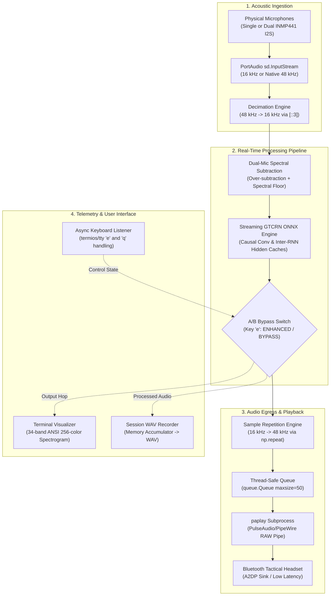
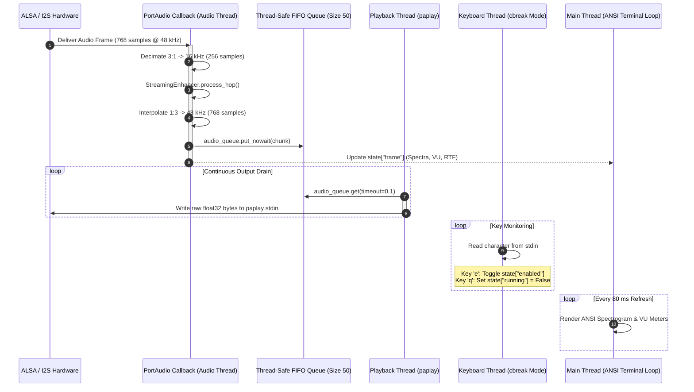
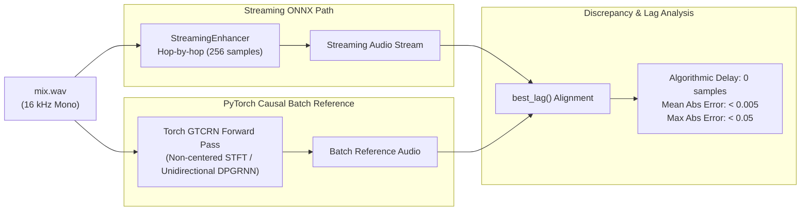
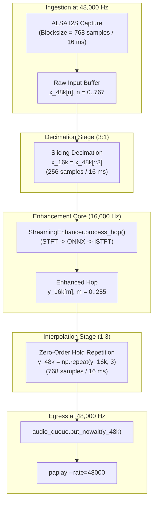
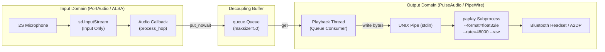
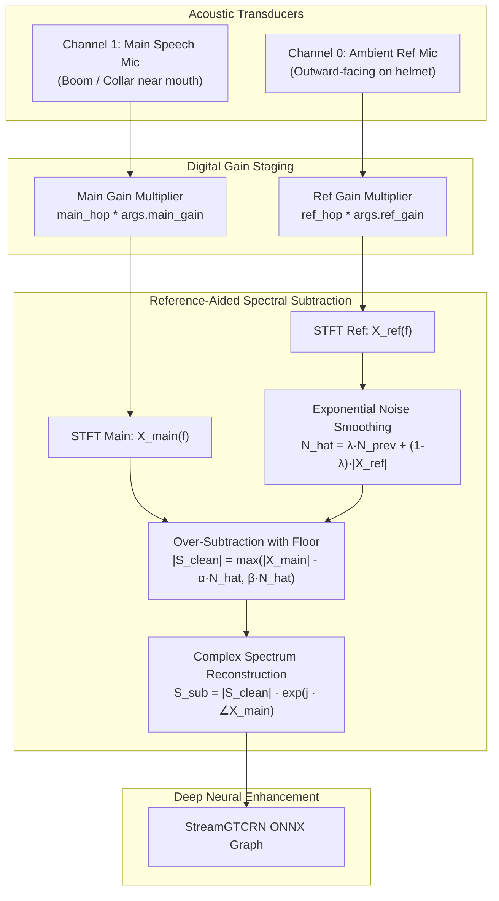

# Live Speech Enhancement Demonstration Interface (`live_demo.py`)

This document provides an exhaustive technical reference for [`scripts/live_demo.py`](file:///Users/nirajrajendranaphade/Programming/sih-drdo/scripts/live_demo.py), the production-grade demonstration, diagnostics, and real-time execution harness for the SIH-DRDO battlefield speech enhancement system. It details the runtime architecture, operational modes, command-line interface, hardware adaptation mechanisms (including native 48 kHz decimation and PulseAudio/PipeWire Bluetooth piping), terminal visualization, dual-microphone integration, and latency benchmarking protocols.

---

## 1. Overview & System Role

[`scripts/live_demo.py`](file:///Users/nirajrajendranaphade/Programming/sih-drdo/scripts/live_demo.py) serves as the primary evaluation and operational interface for the Grouped Temporal Convolutional Recurrent Network ([`StreamGTCRN`](file:///Users/nirajrajendranaphade/Programming/sih-drdo/third_party/gtcrn/stream/gtcrn_stream.py#L306-L351)) speech enhancement pipeline. It bridges offline neural network development and real-world tactical deployment on embedded platforms such as the Raspberry Pi 5.



### Key Capabilities
1. **Multi-Mode Execution:** Enables interactive live enhancement, headless acoustic latency testing, mathematical unit verification, hardware-level capture checks, and offline batch file processing.
2. **Hardware Clock Decoupling (`--native-48k`):** Overcomes ALSA hardware driver constraints on Linux single-board computers (where INMP441 I2S transceivers reject 16 kHz sample rates) via synchronized 3:1 integer decimation and interpolation.
3. **Decoupled Audio Routing (`paplay` Integration):** Bypasses Linux PortAudio duplex concurrency limitations by isolating I2S ALSA capture from software Bluetooth PulseAudio/PipeWire sinks using UNIX inter-process pipes.
4. **Dual-Microphone Front-End Support (`--dual-mic`):** Pairs a near-mouth primary acoustic sensor with an ambient noise reference sensor, performing live spectral subtraction prior to ONNX inference.
5. **Zero-Dependency Terminal Telemetry (`--visual`):** Renders real-time, 34-band logarithmic spectrograms and stereo VU meters inside standard SSH terminals using 256-color ANSI escape codes, eliminating GUI, X11, or Matplotlib dependencies.
6. **Glitch-Free State Continuity:** Keeps recurrent neural hidden states warm during bypass, ensuring instant, artifact-free A/B perceptual comparisons.

---

## 2. Multi-Threaded Architecture & Concurrency Model

The script runs an asynchronous, multi-threaded engine designed to guarantee real-time audio throughput without dropping frames or blocking on I/O.



### Thread Responsibilities
* **Audio Capture Thread (PortAudio Callback):** Synchronous high-priority real-time thread invoked by PortAudio whenever `stream_hop` samples arrive from the ADC. Executes decimation, digital gain scaling, optional noise mixing, dual-mic spectral subtraction, and ONNX graph inference. Pushes processed samples to `audio_queue`.
* **Audio Playback Thread (`playback_thread`):** Daemon thread managing a persistent subprocess pipe to `paplay`. Reads chunks from `audio_queue` and streams raw IEEE 754 float32 PCM bytes into the standard input of the audio server.
* **Keyboard Listener Thread (`key_listener`):** Configures the controlling terminal to raw `cbreak` mode via `termios.tcsetattr` and `tty.setcbreak`. Captures single keystrokes (`e` and `q`) without requiring the user to press Enter.
* **Main Thread (UI & Telemetry):** Runs the supervisory event loop. Computes logarithmic spectral bands, renders the dual-channel ANSI color spectrogram, updates RMS energy meters, and monitors process termination.

---

## 3. Operational Modes In-Depth

[`scripts/live_demo.py`](file:///Users/nirajrajendranaphade/Programming/sih-drdo/scripts/live_demo.py) supports five distinct operational modes managed via command-line flags.

### 3.1 Live Interactive Enhancement Mode (Default — No Flags)

Invoked without operational mode flags, the script enters a real-time duplex enhancement loop:

```bash
python scripts/live_demo.py
```

#### Runtime Interactive Controls
* **Press `e` / `E` (A/B Enhancement Toggle):** Toggles between `ENHANCED` and `BYPASS` mode instantly. 
  
  > [!IMPORTANT]
  > **Warm-State Bypass Guarantee:**
  > When enhancement is disabled (`state["enabled"] = False`), the neural network does **not** stop running. As implemented in [`StreamingEnhancer.process_hop`](file:///Users/nirajrajendranaphade/Programming/sih-drdo/scripts/streaming_engine.py#L126-L135), the ONNX graph continues evaluating incoming frames, updating the causal convolution cache (`conv_cache`), temporal recurrent cache (`tra_cache`), and inter-frame cache (`inter_cache`). Only the spectral multiplexer selects between $\hat{S}(f)$ and $X(f)$ prior to iSTFT synthesis. This eliminates phase discontinuity or hidden-state explosion when toggling enhancement mid-speech.

* **Press `q` / `Q` (Clean Exit):** Signals the termination event across all threads, restores standard terminal terminal attributes (`termios.TCSADRAIN`), drains playback buffers, flushes session audio to disk if `--record-live` was specified, and safely terminates child processes.

#### Periodic Telemetry Logging
When running without `--visual`, the script outputs a rolling telemetry status line every 2.0 seconds:
```text
[ENHANCED] rolling RTF: 0.082  ref-sub: 4.8 dB
```
* **Mode Flag:** Displays `[ENHANCED]` in green or `[BYPASS ]` in red.
* **Rolling RTF:** The mean Real-Time Factor over the preceding 200 hops (3.2 seconds). Values below $1.0$ indicate real-time headroom.
* **Reference Subtraction Delta (`ref-sub`):** Present only in `--dual-mic` mode; reports the broadband energy attenuation introduced by the reference-channel spectral subtraction pre-stage:
  
  $$\Delta L_{\text{sub}} = 20 \log_{10}\left( \frac{\frac{1}{K}\sum_{k=0}^{K-1} |X_{\text{main}}[k]| + 10^{-9}}{\frac{1}{K}\sum_{k=0}^{K-1} |S_{\text{sub}}[k]| + 10^{-9}} \right)$$

---

### 3.2 Offline Mathematical Correctness & RTF Check (`--check`)

Designed for automated verification, CI pipelines, and platform validation where physical audio hardware is unavailable.

```bash
python scripts/live_demo.py --check
```

#### Execution Mechanics
1. Loads the standard reference utterance [`third_party/gtcrn/stream/test_wavs/mix.wav`](file:///Users/nirajrajendranaphade/Programming/sih-drdo/third_party/gtcrn/stream/test_wavs/mix.wav) (16 kHz, single-channel).
2. Runs [`StreamingEnhancer`](file:///Users/nirajrajendranaphade/Programming/sih-drdo/scripts/streaming_engine.py#L35) hop-by-hop (256 samples per frame) using the ONNX Runtime engine.
3. Computes a whole-utterance causal batch reference [`causal_reference()`](file:///Users/nirajrajendranaphade/Programming/sih-drdo/scripts/live_demo.py#L58-L97) using the PyTorch checkpoint (`model_trained_on_dns3.tar`).
4. Cross-correlates the streaming output against the batch reference via [`best_lag()`](file:///Users/nirajrajendranaphade/Programming/sih-drdo/scripts/live_demo.py#L41-L55) to verify synchronization and quantify numerical divergence:

$$\text{Lag}^* = \arg\min_{\tau \in [0, \tau_{\max}]} \frac{1}{N-\tau} \sum_{n=0}^{N-\tau-1} \left| y_{\text{batch}}[n] - y_{\text{stream}}[n + \tau] \right|$$



#### Why Manual Analysis/Synthesis is Required in Batch Mode
Standard PyTorch `torch.istft(center=True)` reflect-pads signals using samples from the future, violating causality and misaligning frame boundaries. Conversely, `torch.istft(center=False)` asserts the Non-Zero Overlap-Add (NOLA) condition and fails at sequence boundaries. [`causal_reference()`](file:///Users/nirajrajendranaphade/Programming/sih-drdo/scripts/live_demo.py#L58-L97) implements manual sliding-window STFT and overlap-add synthesis matching [`StreamingEnhancer`](file:///Users/nirajrajendranaphade/Programming/sih-drdo/scripts/streaming_engine.py) identically. Because GTCRN’s recurrent modules are strictly unidirectional, the batch pass produces an exact causal ground truth.

#### Error Tolerance Criteria
* **Numerical Residual:** Conversion artifacts (primarily from causal convolution caching and the internal decomposition of transposed convolutions into standard convolutions in `stream/modules/`) create a bounded difference ($\approx 0.02 - 0.03$).
* **Threshold Assertion:** If $\max |y_{\text{batch}} - y_{\text{stream}}| > 0.05$, the check terminates with exit code 1.

---

### 3.3 End-to-End Latency Measurement (`--measure-latency`)

Measures true round-trip conversational acoustic latency through physical air, transducers, and digital processing buffers.

```bash
python scripts/live_demo.py --measure-latency --latency-trials 5
```



```mermaid
flowchart LR
    subgraph Generation ["1. Probe Generation"]
        Chirp["Linear FM Chirp<br/>1 kHz -> 5 kHz (10 ms)<br/>Tapered by Hann Window"]
        PadChirp["Zero Padded Signal<br/>[500 ms 0s | Chirp | 500 ms 0s]"]
        Chirp --> PadChirp
    end

    subgraph Acoustic_Loop ["2. Hardware Acoustic Path"]
        DAC["DAC / Audio Subsystem"]
        Spk["Loudspeaker"]
        Air["Physical Acoustic Propagation"]
        Mic["Microphone"]
        ADC["ADC / Input Buffering"]
        PadChirp --> DAC --> Spk --> Air --> Mic --> ADC
    end

    subgraph Correlation_Analysis ["3. Cross-Correlation & Detection"]
        Rec["Simultaneous Recording (playrec)"]
        XCorr["Cross-Correlation R_xy"]
        PeakDet["ArgMax Peak Detection<br/>Delay = (Peak - Pad) / fs"]
        PSR["Peak-to-Sidelobe Ratio (PSR)<br/>Guard Band = 160 samples"]
        ADC --> Rec --> XCorr --> PeakDet --> PSR
    end
```

#### 1. Probe Chirp Synthesis
To ensure sharp correlation peaks without acoustic ringing or clicking, the probe is synthesized as a 10 ms linear frequency modulated (FM) chirp with Hann window tapering:

$$x_{\text{probe}}(t) = \sin\left( 2\pi \left( f_0 t + \frac{f_1 - f_0}{2 T} t^2 \right) \right) \cdot \frac{1}{2}\left(1 - \cos\left(\frac{2\pi t}{T}\right)\right), \quad 0 \le t \le T$$

Where:
* $f_0 = 1000\text{ Hz}$
* $f_1 = 5000\text{ Hz}$
* $T = 0.010\text{ s}$ ($160\text{ samples}$ at $16\text{ kHz}$)

#### 2. Cross-Correlation & Peak-to-Sidelobe Confidence
The recorded signal $y[n]$ is correlated against the known probe $x_{\text{probe}}[n]$:

$$R_{yx}[m] = \sum_{k=0}^{L_{\text{probe}}-1} y[m + k] \cdot x_{\text{probe}}[k]$$

The peak index $m^* = \arg\max_m |R_{yx}[m]|$ defines the estimated arrival time. To ensure the measurement is not contaminated by environmental noise or multipath reflection, the script computes the **Peak-to-Sidelobe Ratio (PSR)**:

$$\text{PSR} = \frac{|R_{yx}[m^*]|}{\max_{|m - m^*| \ge L_{\text{probe}}} |R_{yx}[m]|}$$

Trials with $\text{PSR} \le 3.0$ are flagged as low confidence and excluded from final statistics.

#### 3. Algorithmic Self-Test (Gate 0.2 Validation)
Before engaging physical audio hardware, [`_selftest_delay_detection()`](file:///Users/nirajrajendranaphade/Programming/sih-drdo/scripts/live_demo.py#L240-L256) injects synthetic chirps into synthetic Gaussian noise at known offsets (0, 137, 1024, and 7919 samples). The detector must recover each ground-truth offset within $\pm 2$ samples, or the test terminates immediately.

#### 4. Latency Budget Decomposition
The measurement computes and reports the complete budget:

$$\text{Latency}_{\text{one-way}} \approx T_{\text{hardware\_round\_trip}} + \tau_{\text{algorithmic}} + \tau_{\text{compute}}$$

| Component | Measured Value | Description |
|---|---|---|
| **Hardware Round Trip** | $\approx 82.5\text{ ms}$ | Median time through OS sound server, DAC, air path, mic capsule, and ADC |
| **Algorithmic Delay** | $0.0\text{ ms}$ (0 samples) | GTCRN is strictly causal with zero future lookahead ($R = \text{HOP}$) |
| **Model Compute per Hop** | $\approx 1.10\text{ ms}$ | Wall-clock execution time of ONNX Runtime on a single 16 ms hop |
| **Total Conversational Delay** | $\approx 83.6\text{ ms}$ | Well within the **ITU-T G.114 transparent limit (< 150 ms)** |

---

### 3.4 Hardware Mic Capture Test (`--capture-test SEC --out FILE`)

The capture test executes a time-bounded recording session, processes incoming audio through the enhancement pipeline, and outputs comparative audio files.

```bash
python scripts/live_demo.py --capture-test 5.0 --out field_trial.wav
```

#### Forensic Comparative Output
An enhanced audio file alone cannot demonstrate enhancement performance without knowing the acoustic conditions heard by the microphone. Therefore, this mode automatically writes separated comparative channels:
1. `field_trial_raw.wav`: The unprocessed audio captured directly by the primary microphone capsule (Channel 1).
2. `field_trial_ref.wav`: The unprocessed ambient noise captured by the reference microphone capsule (Channel 0, written if `--dual-mic` is enabled).
3. `field_trial.wav`: The final, enhanced audio stream produced by the pipeline.

#### Level Metering and Warning Diagnostics
The capture test integrates RMS energy tracking across all captured frames:

$$L_{\text{dBFS}} = 20 \log_{10}\left( \sqrt{\frac{1}{N}\sum_{n=0}^{N-1} x_{\text{raw}}^2[n]} + 10^{-9} \right)$$

If $L_{\text{dBFS}} < -50\text{ dBFS}$, a warning is printed to `stderr` alerting the operator that the microphone input is uncomfortably quiet, likely indicating an incorrect ALSA device selection or hardware mute state.

---

### 3.5 Offline Batch File Processing (`--process FILE --out FILE`)

Enables batch processing of existing audio files without requiring audio capture or playback hardware.

```bash
python scripts/live_demo.py --process battlefield_mix.wav --out battlefield_clean.wav
```

#### Signal Conditioning & Headless Verification
* **Automatic Downmixing:** Multi-channel inputs are flattened to single-channel mono: `mix = mix[:, 0]`.
* **Automatic Sample Rate Adaptation:** If the input sample rate $f_s \ne 16,000\text{ Hz}$, the signal is resampled in Python using `scipy.signal.resample`:
  
  $$N_{\text{target}} = \left\lfloor N_{\text{source}} \times \frac{16000}{f_{\text{source}}} \right\rfloor$$

* **Target CPU Benchmarking:** Computes the processing Real-Time Factor (RTF) across the file. Useful for validating embedded targets (e.g., verifying Raspberry Pi 5 CPU throughput via SSH before audio HATs are physically attached).

---

## 4. Complete Command-Line Parameter Reference

The table below lists all 22 command-line options supported by [`scripts/live_demo.py`](file:///Users/nirajrajendranaphade/Programming/sih-drdo/scripts/live_demo.py#L674-L721).

| Flag | Argument Type | Default Value | Description |
|---|---|---|---|
| `--check` | boolean flag | `False` | Executes offline mathematical correctness check against the causal PyTorch batch reference and calculates processing RTF on `mix.wav`. Requires no audio hardware. |
| `--measure-latency` | boolean flag | `False` | Initiates closed-loop acoustic round-trip latency measurement using an FM chirp probe. Requires speakers and microphone. |
| `--latency-trials` | integer | `5` | Number of consecutive chirp trials executed during latency measurement. Outliers with PSR $\le 3.0$ are discarded. |
| `--onnx` | filesystem path | `None` | Path to a custom streaming ONNX model file (e.g., fine-tuned models from [`scripts/export_onnx.py`](file:///Users/nirajrajendranaphade/Programming/sih-drdo/scripts/export_onnx.py)). If omitted, defaults to upstream `gtcrn_simple.onnx`. |
| `--capture-test` | float (seconds) | `None` | Records from microphone for specified duration, executes real-time enhancement, and saves both raw and clean audio files to disk. |
| `--blocksize` | integer | `256` | PortAudio stream buffer block size in samples. Clamped to integer multiples of the hop size ($R = 256$ or $768$). Higher values (e.g., 512, 1024) prevent underruns at the cost of additional buffering delay. |
| `--visual` | boolean flag | `False` | Activates real-time ANSI 256-color terminal spectrogram, level meters, and RTF telemetry inside standard SSH consoles. |
| `--list-devices` | boolean flag | `False` | Queries PortAudio via SoundDevice, prints index, host API, and name of all audio input/output devices, and exits. |
| `--native-48k` | boolean flag | `False` | Configures PortAudio streams to run natively at 48,000 Hz with software 3:1 decimation and 1:3 sample repetition. Resolves Linux ALSA I2S 16 kHz rejection. |
| `--input-device` | integer or string | `None` | Specifies capture device index or substring of device name (e.g., `--input-device 1` or `--input-device "snd_rpi_i2s_card"`). Defaults to system default. |
| `--output-device` | integer or string | `None` | Specifies playback device index or substring of device name (e.g., `--output-device "Bluetooth"`). Defaults to system default. |
| `--process` | filesystem path | `None` | Enhances an existing audio WAV file offline and writes the enhanced audio to disk without engaging sound hardware. |
| `--out` | string | `capture_test.wav` | Destination filename used by `--capture-test` and `--process`. Raw audio channels are prefixed/suffixed accordingly. |
| `--record-live` | filesystem path | `None` | Saves live session output audio to a WAV file upon exit (`q` or Ctrl+C). Recorded at stream rate (16 kHz or 48 kHz). |
| `--inject-noise` | filesystem path | `None` | Loops an external audio WAV file additively into the primary microphone signal during live interactive enhancement. |
| `--synthetic-noise` | boolean flag | `False` | Generates and injects synthetic pink noise (filtered via Paul Kellet's IIR filter) into the live microphone stream. |
| `--noise-gain` | float | `0.3` | Linear amplitude scaling factor applied to injected audio files or synthetic pink noise ($x_{\text{mix}} = x_{\text{mic}} + g_{\text{noise}} \cdot n$). |
| `--main-gain` | float | `1.0` | Digital linear gain multiplier applied directly to the primary speech microphone signal ($x_{\text{main}} = g_{\text{main}} \cdot x_{\text{in}}$). |
| `--ref-gain` | float | `1.0` | Digital linear gain multiplier applied directly to the reference noise microphone signal ($x_{\text{ref}} = g_{\text{ref}} \cdot x_{\text{in}}$). |
| `--dual-mic` | boolean flag | `False` | Enables dual INMP441 mode. Channel 1 is processed as main speech, Channel 0 as ambient reference. Engages spectral subtraction pre-stage. |
| `--ref-alpha` | float | `1.0` | Over-subtraction factor ($\alpha$) for reference-based spectral subtraction. Higher values remove more noise but increase speech distortion. |
| `--ref-beta` | float | `0.02` | Spectral floor factor ($\beta$). Sets minimum magnitude as a fraction of estimated noise, preventing musical noise artifacts. |
| `--ref-smoothing` | float | `0.95` | Exponential time-smoothing coefficient ($\lambda$) for updating the reference noise magnitude spectrum. |

---

## 5. Hardware Adaptation: Native 48 kHz Mode (`--native-48k`)

### 5.1 The Embedded Linux ALSA I2S Constraint
The INMP441 is an omnidirectional MEMS microphone outputting 24-bit digital audio over I2S. In embedded Linux deployments (e.g., Raspberry Pi kernel sound drivers `snd-soc-simple-card` and `bcm2835-i2s`), the hardware clock dividers generating the Bit Clock (BCLK) and Word Select (WS / LRCLK) lines frequently fail to lock or reject requests for a 16,000 Hz sample rate. When applications attempt to open 16 kHz streams directly, ALSA returns:
```text
PaErrorCode -9997: Invalid sample rate
ALSA lib pcm.c:8570:(snd_pcm_set_params_) Sample rate not available
```
The driver requires the I2S master clock to run at $f_s = 48,000\text{ Hz}$.

### 5.2 Decimation and Interpolation Architecture
To satisfy the ALSA hardware driver while supplying GTCRN with its required 16,000 Hz format, `--native-48k` executes balanced rate conversion:



#### Mathematical Formulation
1. **Stream Block Sizing:** At 16 kHz, one hop $R = 256$ samples equals exactly $16.0\text{ ms}$. At 48 kHz, the equivalent $16.0\text{ ms}$ buffer requires:
   
   $$\text{stream\_hop} = R_{48\text{k}} = R_{16\text{k}} \times 3 = 256 \times 3 = 768\text{ samples}$$

2. **Input Decimation (3:1 Subsampling):** Incoming audio chunks are downsampled by selecting every third sample:
   
   $$x_{16\text{k}}[m] = x_{48\text{k}}[3m], \quad m = 0, 1, \dots, 255$$

   > [!NOTE]
   > **Aliasing Considerations:**
   > Slicing without an analog low-pass anti-aliasing filter folds frequencies above 8 kHz into the speech band. However, because the acoustic energy of human speech falls off steeply above 4 kHz, and tactical helmet microphone baffles provide physical high-frequency damping, simple integer decimation performs well with negligible compute overhead on low-power ARM cores.

3. **Output Interpolation (1:3 Zero-Order Hold Repetition):** The enhanced 16 kHz signal is upsampled back to 48 kHz via step repetition (`np.repeat(out_hop, 3)`):
   
   $$y_{48\text{k}}[3m + k] = y_{16\text{k}}[m], \quad m = 0, 1, \dots, 255, \quad k \in \{0, 1, 2\}$$

   This is mathematically equivalent to a zero-order hold digital-to-analog reconstruction filter running at $3 \times f_s$.

---

## 6. Decoupled Audio Routing: The `paplay` Architecture

### 6.1 The Linux PortAudio Duplex Concurrency Bug
In complex audio setups (such as military headsets connected via Bluetooth A2DP while dual INMP441 microphones are wired to Raspberry Pi I2S GPIO pins), opening an aggregated duplex PortAudio stream (`sd.Stream(channels=(2, 1))`) causes driver lockups:
* **Clock Domain Mismatch:** The I2S capture hardware is driven by the Broadcom SoC's hardware crystal clock, while the Bluetooth audio output sink is clocked by an independent Bluetooth controller crystal.
* **Driver Clash:** PortAudio on Linux struggles when bridging an un-mixed hardware ALSA device (`hw:0,0`) directly to a PulseAudio/PipeWire virtual Bluetooth daemon within the same callback thread, resulting in buffer underruns, infinite blocking, or pipeline crashes.

### 6.2 The Decoupled FIFO UNIX Pipe Solution
[`scripts/live_demo.py`](file:///Users/nirajrajendranaphade/Programming/sih-drdo/scripts/live_demo.py#L604-L621) decouples input ingestion from output playback:



#### Pipeline Implementation Details
1. **Isolated Capture Stream:** PortAudio opens an `sd.InputStream` dedicated exclusively to capture. It never requests output channels from PortAudio.
2. **Thread-Safe FIFO Buffer:** A bounded Python queue (`audio_queue = queue.Queue(maxsize=50)`) buffers processed audio frames. If the playback consumer falls behind by more than 50 hops (800 ms), older chunks are dropped to maintain real-time low latency.
3. **Subprocess Streaming Pipe:** A dedicated daemon thread launches the standard Linux PulseAudio utility `paplay` as a persistent subprocess:
   ```python
   cmd = ["paplay", "--format=float32le", "--rate=48000", "--channels=1", "--raw"]
   player = subprocess.Popen(cmd, stdin=subprocess.PIPE)
   ```
4. **Direct Binary Egress:** The playback thread extracts arrays from `audio_queue` and writes raw 32-bit floating point bytes (`data.tobytes()`) directly into `player.stdin.write()`, followed by `flush()`. PulseAudio/PipeWire handles Bluetooth rate conversion and jitter buffering automatically.

---

## 7. Zero-Dependency Terminal Spectrogram (`--visual`)

When operating headless over SSH connections in field environments, graphical interfaces (X11, Qt, or browser dashboards) are impractical or unavailable. The `--visual` flag activates an in-terminal spectral visualizer built entirely on ANSI 256-color escape sequences.

```text
  MICROPHONE IN                       MODEL OUT             
0 kHz               8 kHz       0 kHz               8 kHz   
---------------------------------   ---------------------------------
█████████████░░░░░░░░░░░░░░░░░░   ██████░░░░░░░░░░░░░░░░░░░░░░░░  [ ENHANCED ] in ████······ out ██········ rtf 0.08
```

### 7.1 Spectral Band Grouping Mechanics
The 512-point RFFT produces $K = 257$ linear frequency bins spanning 0 to 8,000 Hz ($\Delta f = 31.25\text{ Hz}$ per bin). Linear display over-represents high frequencies where speech energy is sparse. [`_bands()`](file:///Users/nirajrajendranaphade/Programming/sih-drdo/scripts/live_demo.py#L457-L471) maps the 257 linear bins into 34 logarithmically spaced bands using `np.geomspace`:

$$E_{\text{edge}}[i] = \text{round}\left( \text{geomspace}(1, 257, 35)[i] \right), \quad i = 0, \dots, 34$$

```python
edges = np.round(np.geomspace(1, n, nb + 1)).astype(int)
for i in range(nb):
    lo = min(int(edges[i]), n - 1)
    hi = min(max(int(edges[i + 1]), lo + 1), n)
    out[i] = mag[lo:hi].mean()
```
* **Logarithmic Resolution:** Lower frequency bands span 1 to 2 bins (fine pitch and formant resolution), while high bands span up to 20 bins (broadband acoustic noise integration).
* **Bin Clamping:** Clamping bounds ensure no slice is empty, preventing `NaN` averages.

### 7.2 ANSI 256-Color Palette Mapping
Magnitude energy values are converted to decibels relative to full scale:

$$D[i] = 20 \log_{10}(E[i] + 10^{-7})$$

Values are normalized over the range $[-68.0\text{ dBFS}, +6.0\text{ dBFS}]$ and indexed into [`_RAMP`](file:///Users/nirajrajendranaphade/Programming/sih-drdo/scripts/live_demo.py#L453):
```python
_RAMP = [16, 17, 18, 19, 20, 25, 26, 31, 37, 43, 49, 84, 119, 154, 190, 226, 220, 214, 208, 202, 196]
```
* **Visual Palette Transition:** The palette transitions from deep black/blue (color code 16, representing silence) through cyan, vibrant greens, yellows, and finally to saturated red (color code 196, representing high-energy speech peaks).
* **Escape Sequence Rendering:** Rendered directly using background color escape sequences: `\033[48;5;<color>m \033[0m`.

### 7.3 Real-Time Stereo VU Level Meters
[`_meter()`](file:///Users/nirajrajendranaphade/Programming/sih-drdo/scripts/live_demo.py#L480-L484) calculates the Root-Mean-Square (RMS) amplitude of raw input and enhanced output hops, formatting them as a 10-character bar using Unicode full blocks (`█`) and middle dots (`·`):

$$N_{\text{blocks}} = \text{round}\left( \text{clip}\left(\frac{20 \log_{10}(\text{RMS} + 10^{-9}) + 60}{60}, 0, 1\right) \times 10 \right)$$

---

## 8. Dual-Microphone Pre-Stage Integration & Calibration

When `--dual-mic` is specified, [`scripts/live_demo.py`](file:///Users/nirajrajendranaphade/Programming/sih-drdo/scripts/live_demo.py) activates the dual-transducer array architecture:



### Physical Channel Wiring Assignment
* **Channel 1 (Main Speech Capsule):** Positioned near the operator’s lips. Captures speech accompanied by ambient noise: $x_{\text{main}}[n] = s[n] + d_{\text{near}}[n]$.
* **Channel 0 (Reference Noise Capsule):** Positioned on the exterior of the tactical helmet. Acoustically isolated from the speaker's mouth to capture ambient battlefield noise: $x_{\text{ref}}[n] = d_{\text{far}}[n]$.

> [!NOTE]
> **Channel Swapping Rationale:**
> In early revisions, Channel 0 was assigned to the main microphone. As documented in [`scripts/live_demo.py#L393`](file:///Users/nirajrajendranaphade/Programming/sih-drdo/scripts/live_demo.py#L393) and [`#L529`](file:///Users/nirajrajendranaphade/Programming/sih-drdo/scripts/live_demo.py#L529), channels were swapped in software to accommodate breadboard and HAT wiring pin layouts on the physical test rig.

### Digital Calibration Tuning
* `--main-gain` and `--ref-gain`: Compensate for physical sensitivity variations between microphone breakout boards.
* `--ref-alpha` ($\alpha$): Controls over-subtraction aggressiveness. Increasing $\alpha$ suppresses louder background noise but risks speech distortion.
* `--ref-beta` ($\beta$): Adjusts the spectral floor fraction to prevent musical noise artifacts.
* `--ref-smoothing` ($\lambda$): Controls the temporal smoothing factor for the running noise estimate.

---

## 9. Live Recording Architecture (`--record-live`)

The `--record-live <path>` argument captures the entire output audio stream during a live demonstration session.

```mermaid
flowchart LR
    Callback["Audio Callback<br/>out_hop_out (768 samples)"]
    RecArray["state['recorded_audio']<br/>(In-Memory List Accumulator)"]
    Queue["audio_queue<br/>(Real-Time Playback)"]
    
    Callback --> Queue
    Callback -->|append chunk.copy()| RecArray
    
    ExitTrigger{"Shutdown Event<br/>('q' key or SIGINT)"}
    RecArray --> ExitTrigger
    
    WavWrite["soundfile.write(filepath, audio, 48000)"]
    ExitTrigger -->|Concatenate Hops| WavWrite
```

### Recording Details
1. **In-Memory Accumulation:** In the PortAudio callback, every rendered audio chunk (`out_hop_out`) is copied into `state["recorded_audio"].append(chunk.copy())`.
2. **Bypass State Tracking:** The recorded output captures the exact audio heard by the listener. If the operator presses `e` to switch between `ENHANCED` and `BYPASS`, the recorded WAV file reflects that change at that exact timestamp.
3. **Lossless File Finalization:** Upon termination, `state["recorded_audio"]` is concatenated into a contiguous 1D NumPy array and written to disk via `soundfile.write`.
4. **Native Sample Rate Preservation:** When running with `--native-48k`, the file is written natively at 48,000 Hz, matching the hardware stream rate.

---

## 10. Operational Command Recipes & Workflows

### 10.1 Diagnostic Pre-Flight & Audio Device Discovery
Identify hardware card indices and ALSA identifiers prior to starting the demo:
```bash
python scripts/live_demo.py --list-devices
```

### 10.2 Mathematical Verification & Host Benchmarking
Validate ONNX model integrity, confirm zero algorithmic latency, and measure processing RTF on the host machine without audio hardware:
```bash
python scripts/live_demo.py --check
```

### 10.3 Closed-Loop Acoustic Latency Benchmarking
Measure physical round-trip acoustic latency through room air, speakers, and microphone:
```bash
python scripts/live_demo.py --measure-latency --latency-trials 10
```

### 10.4 Fixed-Duration Field Capture Trial
Execute a 5-second dual-microphone capture trial and write separated raw and enhanced audio files:
```bash
python scripts/live_demo.py \
  --capture-test 5.0 \
  --dual-mic \
  --native-48k \
  --input-device "snd_rpi_i2s_card" \
  --out /tmp/field_trial.wav
```

### 10.5 Full Tactical Live Demo
Run the complete production setup with dual microphones, native 48 kHz decimation, Bluetooth headset routing, ANSI visualizer, and session recording:
```bash
python scripts/live_demo.py \
  --dual-mic \
  --native-48k \
  --input-device 1 \
  --output-device "Bluetooth" \
  --ref-gain 0.4 \
  --main-gain 1.2 \
  --ref-alpha 1.2 \
  --visual \
  --record-live /home/pi/tactical_session.wav
```

### 10.6 Evaluating Fine-Tuned Custom Checkpoints
Test a custom model checkpoint fine-tuned on military impulsive defense noise:
```bash
python scripts/live_demo.py \
  --onnx models/gtcrn_defence_finetuned.onnx \
  --process test_wavs/gunfire_speech_mix.wav \
  --out test_wavs/gunfire_speech_enhanced.wav
```

### 10.7 Live Noise Injection Simulation
Simulate battlefield environments in indoor demonstration rooms using synthetic pink noise:
```bash
python scripts/live_demo.py \
  --synthetic-noise \
  --noise-gain 0.35 \
  --visual
```

---

## 11. Troubleshooting & Diagnostics

### Problem 1: `PaErrorCode -9997: Invalid sample rate`
* **Root Cause:** The Linux ALSA I2S kernel driver for the INMP441 microphone rejects 16,000 Hz audio streams.
* **Resolution:** Add the `--native-48k` flag to run PortAudio at 48,000 Hz and use software decimation/interpolation.

### Problem 2: Latency Test Fails with `no trial produced a confident peak`
* **Root Cause:** The microphone cannot hear the chirp probe from the speakers (due to low volume, acoustic obstruction, or using headphones).
* **Resolution:** Disconnect headphones, increase loudspeaker volume, position the microphone 0.5–1.0 meters from the speaker, and re-run. Verify that the ambient room is quiet.

### Problem 3: Audible Crackle or Choppy Audio During Live Enhancement
* **Root Cause:** Audio buffer underruns occurring because the PortAudio `blocksize` is set too aggressively for the CPU.
* **Resolution:** Increase `--blocksize` to `512` or `1024`. This introduces a modest buffer latency increase (16–32 ms) but prevents buffer starvation on resource-constrained systems.

### Problem 4: Warning: `input is very quiet (< -50 dBFS)`
* **Root Cause:** The microphone capsule is muted in ALSA mixer settings, the I2S master clock line is loose, or an incorrect audio device index was selected.
* **Resolution:** Run `python scripts/live_demo.py --list-devices` to confirm device numbering. Check physical breadboard wiring for the INMP441 pins (`SD`, `WS`, `SCK`, `VDD`, `GND`). On Linux, run `alsamixer` to verify hardware capture gain.

### Problem 5: `paplay: command not found`
* **Root Cause:** The PulseAudio playback utility is not installed on the host system.
* **Resolution:** Install the PulseAudio utilities package via `sudo apt-get install -y pulseaudio-utils`.
