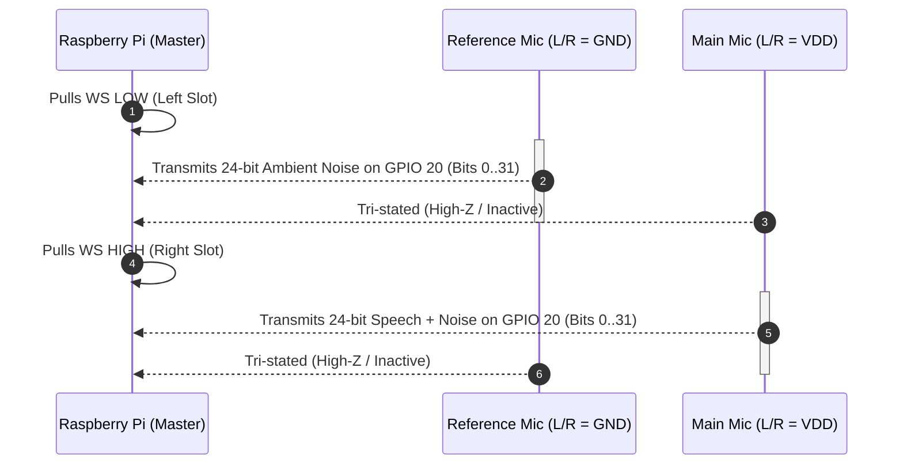
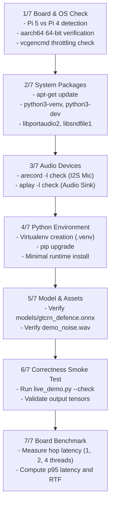

# Edge Hardware Deployment & Dual I2S MEMS Setup Guide: Raspberry Pi 4/5

This document provides a comprehensive, production-grade engineering manual for deploying the DRDO real-time speech enhancement system on edge compute hardware. It details the complete physical wiring, I2S protocol signaling, Linux kernel Device Tree configurations, ALSA subsystem calibration, Bluetooth audio routing, automated provisioning scripts, and field diagnostics for dual INMP441 MEMS microphone arrays on Raspberry Pi 4 Model B and Raspberry Pi 5.

---

## 1. Hardware Requirements & Bill of Materials

Deploying deep neural audio enhancement algorithms under stringent military and tactical constraints requires a low-latency, deterministic hardware platform capable of handling real-time multi-channel digital audio ingestion, vector-accelerated neural inference, and wireless monitoring.

```mermaid
flowchart TD
    subgraph Power Infrastructure
        PSU["Official USB-C Power Supply\nPi 5: 27W (5.1V / 5.0A)\nPi 4: 15W (5.1V / 3.0A)"]
    end

    subgraph Edge Compute Host
        RPi["Raspberry Pi 4B (4GB/8GB) or Pi 5\n- 64-bit ARM Cortex-A76 / A72\n- Hardware I2S Controller (PCM)\n- Broadcom SoC / RP1 I/O Hub"]
        ActiveCooler["Active Cooler / Aluminum Heatsink\nMaintains Max Clock without Thermal Throttling"]
    end

    subgraph Acoustic Transducer Array
        MainMic["Main INMP441 MEMS Mic\n(Positioned at Mouth)\nL/R -> VDD (Right / Ch 1)"]
        RefMic["Reference INMP441 MEMS Mic\n(Facing Ambient Noise)\nL/R -> GND (Left / Ch 0)"]
    end

    subgraph Wireless Audio Output
        BT["Bluetooth Headphones / Tactical Headset\nA2DP Sink (SBC / AAC Codec)"]
    end

    PSU --> RPi
    ActiveCooler -.-> RPi
    RPi -->|3.3V Power & Shared Ground| MainMic
    RPi -->|3.3V Power & Shared Ground| RefMic
    RPi -->|BCLK (GPIO 18) & WS (GPIO 19)| MainMic
    RPi -->|BCLK (GPIO 18) & WS (GPIO 19)| RefMic
    MainMic -->|TDM Time-Multiplexed SD (GPIO 20)| RPi
    RefMic -->|TDM Time-Multiplexed SD (GPIO 20)| RPi
    RPi -.->|PipeWire / BlueZ 2.4 GHz RF| BT
```

### 1.1 Complete Bill of Materials (BOM)

| Component | Specification / Model | Qty | Functional Role in System | Selection Notes & Critical Criteria |
|---|---|:---:|---|---|
| **Edge Compute Host** | Raspberry Pi 5 (4GB or 8GB) *or* Raspberry Pi 4 Model B (4GB / 8GB) | 1 | Real-time audio capture, spectral subtraction, ONNX neural inference, audio playback | Pi 5 provides ~2.5x higher inference throughput via Cortex-A76 cores and dedicated RP1 southbridge. Pi 4 is fully functional but operates closer to real-time budget. |
| **I2S Acoustic Transducers** | INMP441 Omnidirectional MEMS Breakout Boards | 2 | Primary speech capture (Main) and ambient environmental noise capture (Reference) | High SNR (61 dBA), -26 dBFS sensitivity, 24-bit digital $I^2S$ output, bottom-port acoustic inlet. Rejects analog electromagnetic interference (EMI). |
| **Wireless Audio Sink** | Bluetooth Headphones or Tactical Headset | 1 | Real-time wireless audio monitoring of enhanced speech | Must support A2DP (Advanced Audio Distribution Profile). Standard SBC or AAC codecs supported. |
| **System Storage** | MicroSD Card, Class 10 / UHS-I U3 / A2 (32GB+) | 1 | OS boot drive, Debian 12 Bookworm 64-bit root filesystem, Python virtual environment | High random read/write IOPS minimizes pipeline boot latency and log write overhead. |
| **Power Supply Unit (PSU)** | Official Raspberry Pi 27W USB-C PSU (for Pi 5) or 15W USB-C PSU (for Pi 4) | 1 | Stable 5.1V power delivery across dynamic CPU load spikes | Crucial: Non-compliant chargers trigger undervoltage throttling (`0x50005`), degrading CPU frequency and causing buffer underruns. |
| **Interconnects** | Female-to-Female Jumper Wires (20 cm) | 8-10 | Connects 40-pin GPIO header to INMP441 sensor breakout pins | Short wire runs (< 20 cm) are required to preserve high-frequency I2S clock signal integrity (3.072 MHz square waves). |
| **Active Cooling** | Official Pi 5 Active Cooler or Pi 4 Armor Heatsink with Dual Fan | 1 | Dissipates thermal energy during continuous multi-threaded neural inference | Prevents thermal throttling at 80°C which abruptly doubles inference time per hop. |
| **Mechanical Enclosure (Optional)** | 3D-Printed Dual-Mic Boom / Helmet Mount | 1 | Enforces rigid acoustic geometry: 2 cm from mouth, 20 cm baseline separation | Isolates reference transducer from mouth acoustic near-field. |

---

## 2. Raspberry Pi GPIO Pinout for I2S Interfacing

The Raspberry Pi communicates with external digital audio converters (ADCs and DACs) through its hardware **Pulse-Code Modulation (PCM) / Inter-IC Sound ($I^2S$) interface**. On both the Broadcom BCM2711 (Pi 4) and the RP1 I/O Controller (Pi 5), these signals are mapped to dedicated pins on the 40-pin GPIO expansion header.

### 2.1 40-Pin Header Layout & Audio Signal Map

```
                          Raspberry Pi 40-Pin Header
                                 (Top View)
                           +-------------------+
             +3.3V Power --|  1 [X]   [ ]  2  |-- +5V Power
          GPIO 2 (SDA1)  --|  3 [ ]   [ ]  4  |-- +5V Power
          GPIO 3 (SCL1)  --|  5 [ ]   [X]  6  |-- GROUND  <======== [GND]
          GPIO 4 (GPCLK0)--|  7 [ ]   [ ]  8  |-- GPIO 14 (TXD0)
                 GROUND  --|  9 [ ]   [ ] 10  |-- GPIO 15 (RXD0)
          GPIO 17        --| 11 [ ]   [X] 12  |-- GPIO 18 (PCM_CLK) <== [BCLK]
          GPIO 27        --| 13 [ ]   [ ] 14  |-- GROUND
          GPIO 22        --| 15 [ ]   [ ] 16  |-- GPIO 23
             +3.3V Power --| 17 [ ]   [ ] 18  |-- GPIO 24
          GPIO 10 (MOSI) --| 19 [ ]   [ ] 20  |-- GROUND
          GPIO 9 (MISO)  --| 21 [ ]   [ ] 22  |-- GPIO 25
          GPIO 11 (SCLK) --| 23 [ ]   [ ] 24  |-- GPIO 8 (CE0)
                 GROUND  --| 25 [ ]   [ ] 26  |-- GPIO 7 (CE1)
          GPIO 0 (ID_SD) --| 27 [ ]   [ ] 28  |-- GPIO 1 (ID_SC)
          GPIO 5         --| 29 [ ]   [ ] 30  |-- GROUND
          GPIO 6         --| 31 [ ]   [ ] 32  |-- GPIO 12 (PWM0)
          GPIO 13 (PWM1) --| 33 [ ]   [ ] 34  |-- GROUND
[LRCLK] => GPIO 19 (PCM_FS) | 35 [X]   [ ] 36  |-- GPIO 16
          GPIO 26        --| 37 [ ]   [X] 38  |-- GPIO 20 (PCM_DIN) <= [SDATA]
                 GROUND  --| 39 [ ]   [ ] 40  |-- GPIO 21 (PCM_DOUT)
                           +-------------------+
```

### 2.2 Primary I2S Pin Assignment Matrix

| Signal Function | Alternate Name | GPIO Pin | Physical Pin | Suggested Wire Color | Description & Direction |
|---|---|:---:|:---:|:---:|---|
| **BCLK** | Bit Clock / SCK | **GPIO 18** | **Pin 12** | **Yellow** | **Host Out $\rightarrow$ Sensor In:** Shifts individual data bits out of the MEMS ADC registers on every falling edge. |
| **LRCLK** | Word Select / WS | **GPIO 19** | **Pin 35** | **Green** | **Host Out $\rightarrow$ Sensor In:** Frame sync clock. Low = Left Channel, High = Right Channel. Operates at sampling frequency ($f_s$). |
| **SDATA** | Serial Data / SDIN | **GPIO 20** | **Pin 38** | **Blue** | **Sensor Out $\rightarrow$ Host In:** Time-division multiplexed audio bitstream driven by both MEMS microphones. |
| **3.3V VDD** | Logic & Sensor Power | — | **Pin 1** | **Red** | Regulated clean 3.3V DC rail for MEMS analog charge pumps and digital logic. |
| **GND** | Digital & Analog Ground | — | **Pin 6** | **Black** | Common system return path for power, clocks, and high-frequency data signaling. |

> [!CAUTION]
> **Never connect the INMP441 VDD pin to the 5V rail (Pin 2 or Pin 4).** The INMP441 absolute maximum rating is 3.63V. Connecting 5V will instantly destroy the internal charge pump and permanently damage the MEMS diaphragm.

### 2.3 I2S Bus Timing & Clock Calculation

In standard $I^2S$ operation, the Raspberry Pi acts as the **bus master**, generating both the continuous Bit Clock (BCLK) and Word Select (WS/LRCLK). The microphones operate as **slaves**. 

For a stereo audio frame consisting of two 32-bit subframes (64 total bits per audio sample frame):
$$f_{\text{BCLK}} = 2 \times f_s \times N_{\text{bits}}$$

At our native hardware capture rate of $f_s = 48\,000\text{ Hz}$:
$$f_{\text{BCLK}} = 2 \times 48\,000\text{ Hz} \times 32\text{ bits} = 3\,072\,000\text{ Hz} = 3.072\text{ MHz}$$

```
WS (LRCLK)  ---+                 +---------------------------------+
(48 kHz)       |   Left (Ch 0)   |          Right (Ch 1)           |
               +-----------------+                                 +---
BCLK           +-+ +-+ +-+ +-+ +-+ +-+ +-+ +-+ +-+ +-+ +-+ +-+ +-+ +-+
(3.072 MHz)    | | | | | | | | | | | | | | | | | | | | | | | | | | | |
               + +-+ +-+ +-+ +-+ +-+ +-+ +-+ +-+ +-+ +-+ +-+ +-+ +-+ +
SDATA          +-------+-------+-------+---+-----------------------+---
(GPIO 20)      | Ref Mic (Left, L/R=GND)   | Main Mic (Right, L/R=VDD) |
               +---------------------------+---------------------------+
               |<------ 32 BCLK cycles --->|<------ 32 BCLK cycles --->|
```

Every audio sample word consists of 24 active data bits followed by 8 zero-padding bits within each 32-clock subframe.

---

## 3. INMP441 Dual-Microphone Wiring & Bus Multiplexing

The system captures spatial acoustic information via two physical microphones. Because the Raspberry Pi exposes a single hardware $I^2S$ capture channel (one `PCM_DIN` pin), both microphones share the exact same clock and data pins. They are multiplexed in time via the standard $I^2S$ stereo protocol.

### 3.1 Time-Division Multiplexing (TDM) Mechanics

The INMP441 features a dedicated `L/R` (Left/Right) configuration pin:
- When `L/R` is held at **GND (Logic Low)**, the microphone drives data on the `SD` line during the **Left Channel** (`WS` = Low). As soon as `WS` transitions High, the microphone immediately releases the `SD` pin into a **high-impedance (High-Z) tri-state**.
- When `L/R` is held at **VDD (Logic High)**, the microphone keeps its output driver in high impedance during the Left Channel (`WS` = Low), and drives data onto the `SD` line exclusively during the **Right Channel** (`WS` = High).

Because the two microphones tri-state their outputs during opposite phases of the `WS` clock, their `SD` pins can be physically soldered or jumpered together onto the single Raspberry Pi `GPIO 20` line without bus collisions.



### 3.2 Main Microphone Wiring (Near Speaker's Mouth)

The Main microphone is configured as the **Right Channel (Channel 1)**. It is positioned on a rigid boom directly adjacent to the operator's lips ($r \approx 2\text{ cm}$).

| INMP441 Pin | Connected To Destination | Physical Pin / Location | Wire Color | Functional Purpose |
|---|---|:---:|:---:|---|
| **VDD** | 3.3V Rail | Pin 1 | Red | Power supply (+3.3V DC) |
| **GND** | Common Ground | Pin 6 | Black | System return path |
| **SCK** | GPIO 18 (PCM_CLK) | Pin 12 | Yellow | Serial bit clock input |
| **WS** | GPIO 19 (PCM_FS) | Pin 35 | Green | Word select input |
| **SD** | GPIO 20 (PCM_DIN) | Pin 38 | Blue | Serial data output (Right Slot) |
| **L/R** | Local VDD Pin | On Breakout Board | Orange / Red | Hardwired to 3.3V $\rightarrow$ Selects Right Channel (Ch 1) |

### 3.3 Reference Microphone Wiring (Facing Ambient Environment)

The Reference microphone is configured as the **Left Channel (Channel 0)**. It is positioned on the exterior chassis, facing away from the operator's mouth ($r \ge 15\text{ cm}$), isolated from the speaker's direct voice radiation.

| INMP441 Pin | Connected To Destination | Physical Pin / Location | Wire Color | Functional Purpose |
|---|---|:---:|:---:|---|
| **VDD** | 3.3V Rail (Shared with Main Mic) | Pin 1 | Red | Power supply (+3.3V DC) |
| **GND** | Common Ground (Shared with Main Mic)| Pin 6 | Black | System return path |
| **SCK** | GPIO 18 (Shared with Main Mic) | Pin 12 | Yellow | Serial bit clock input |
| **WS** | GPIO 19 (Shared with Main Mic) | Pin 35 | Green | Word select input |
| **SD** | GPIO 20 (Shared with Main Mic) | Pin 38 | Blue | Serial data output (Left Slot) |
| **L/R** | Local GND Pin | On Breakout Board | Black | Hardwired to GND $\rightarrow$ Selects Left Channel (Ch 0) |

> [!NOTE]
> The python streaming engine ([`live_demo.py`](file:///Users/nirajrajendranaphade/Programming/sih-drdo/scripts/live_demo.py)) indexes the incoming stereo buffer as:
> - `indata[:, 1]` = Main Mic (Speech + Near Noise)
> - `indata[:, 0]` = Reference Mic (Ambient Noise Reference)

### 3.4 Complete Hardware Splice Diagram

```
Raspberry Pi 40-Pin Header                   Dual INMP441 MEMS Breakout Modules
+--------------------------+
| Pin 1  (3.3V VDD) -------+========[ SPLICE ]========+---- Main Mic: VDD
|                          |                          +---- Main Mic: L/R (Channel 1)
|                          |                          +---- Ref Mic:  VDD
|                          |
| Pin 6  (GND) ------------+========[ SPLICE ]========+---- Main Mic: GND
|                          |                          +---- Ref Mic:  GND
|                          |                          +---- Ref Mic:  L/R (Channel 0)
|                          |
| Pin 12 (GPIO 18 / BCLK) -+========[ SPLICE ]========+---- Main Mic: SCK
|                          |                          +---- Ref Mic:  SCK
|                          |
| Pin 35 (GPIO 19 / LRCLK)-+========[ SPLICE ]========+---- Main Mic: WS
|                          |                          +---- Ref Mic:  WS
|                          |
| Pin 38 (GPIO 20 / SDATA)-+========[ SPLICE ]========+---- Main Mic: SD
+--------------------------+                          +---- Ref Mic:  SD
```

---

## 4. Linux Kernel & ALSA Audio Subsystem Configuration

The Broadcom SoC hardware PCM peripheral requires specific kernel Device Tree overlays to initialize the clock generators, configure the internal pin multiplexer (ALT0 mode for GPIO 18, 19, 20), and instantiate the ALSA sound card driver.

### 4.1 Enabling I2S in Boot Configuration

On modern Raspberry Pi OS (Debian 12 Bookworm, 64-bit kernel 6.1 or 6.6), boot configuration is located at `/boot/firmware/config.txt`. On older systems (Debian 11 Bullseye), it is located at `/boot/config.txt`.

Edit the file with root privileges:
```bash
sudo nano /boot/firmware/config.txt
```

Append the following two configuration statements to the end of the file:
```ini
# ================================================================
# DRDO Speech Enhancement: Dual INMP441 I2S Audio Hardware Overlay
# ================================================================
dtparam=i2s=on
dtoverlay=googlevoicehat-soundcard
```

#### Why `googlevoicehat-soundcard`?
The `googlevoicehat-soundcard` Device Tree overlay attaches the Linux kernel's generic `voicehat-codec` driver to the BCM2835/BCM2711 PCM core. It configures the Pi as an $I^2S$ master operating in 32-bit slot mode without requiring an auxiliary $I^2C$ control bus. This overlay creates an ALSA capture and playback card interface that handles 2-channel 32-bit stereo streams natively.

Once the configuration is written, reboot the board to recompile the active Device Tree:
```bash
sudo reboot
```

### 4.2 Verifying ALSA Devices

After the reboot, execute `arecord -l` to verify that the kernel successfully registered the $I^2S$ sound card:

```bash
arecord -l
```

Expected diagnostic output:
```text
**** List of CAPTURE Hardware Devices ****
card 1: sndrpigooglevoi [snd_rpi_googlevoicehat_soundcar], device 0: Google voiceHAT SoundCard HiFi voicehat-hifi-0 []
  Subdevices: 1/1
  Subdevice #0: subdevice #0
```

Verify that the card index (here `card 1`) and name (`sndrpigooglevoi`) are correctly exposed.

You can inspect the full hardware capabilities via the ALSA control interface:
```bash
amixer -c sndrpigooglevoi
```

### 4.3 Testing Raw Dual-Channel Audio Capture

Before launching high-level Python inference scripts, verify low-level kernel audio ingestion using `arecord`.

Capture a 5-second test clip using the ALSA plugin hardware interface (`plughw`):
```bash
arecord -D plughw:CARD=sndrpigooglevoi,DEV=0 -c2 -r 48000 -f S32_LE -d 5 test.wav
```

#### Flag Dissection:
- `-D plughw:CARD=sndrpigooglevoi,DEV=0`: Uses the ALSA `plughw` abstraction layer. This automatically negotiates software-level sample rate or format transformations if the raw hardware driver demands exact word alignment.
- `-c2`: Instructs ALSA to open 2 channels (Stereo). This is **mandatory**: the INMP441 I2S bus transmits both Left and Right slots. If opened in mono (`-c1`), the hardware will drop one of the microphones or throw an I/O error.
- `-r 48000`: Specifies a 48 kHz sampling frequency. The INMP441 internal decimation filter and the Raspberry Pi I2S clock dividers operate at 48 kHz natively.
- `-f S32_LE`: Specifies signed 32-bit little-endian format. The INMP441 outputs 24-bit data MSB-aligned inside 32-bit frames. Capturing at `S16_LE` directly at the hardware layer will discard or distort the sign extension.
- `-d 5`: Records for 5 seconds duration.

Inspect the recorded file attributes:
```bash
soxi test.wav
```
Output:
```text
Channels       : 2
Sample Rate    : 48000
Precision      : 32-bit
Duration       : 00:00:05.00 = 240000 samples
File Size      : 1.92M
Bit Rate       : 3.07M
```

---

## 5. Python Environment Setup & Dependencies

The speech enhancement pipeline runs entirely on-device using a streamlined, dependency-minimized runtime environment. 

> [!IMPORTANT]
> **Do NOT install PyTorch (`torch` or `torchaudio`) on the Raspberry Pi.**
> Full PyTorch builds on ARM64 consume over 2.2 GB of disk space, load hundreds of unnecessary dynamic libraries, and pull massive CUDA stubs. The production edge pipeline executes inference strictly via the **ONNX Runtime CPU Execution Provider**, which is heavily optimized with ARM NEON SIMD intrinsics and takes up less than 60 MB.

### 5.1 Environment Provisioning Commands

Execute the following commands from the repository root:

```bash
# Navigate to repository directory
cd ~/sih-drdo

# Create an isolated Python 3 virtual environment
python3 -m venv .venv

# Activate the virtual environment
source .venv/bin/activate

# Upgrade packaging tools inside the environment
pip install --upgrade pip setuptools wheel

# Install the minimal real-time inference dependencies
pip install numpy scipy soundfile sounddevice onnxruntime
```

### 5.2 Dependency Breakdown & Purpose

| Package | Minimum Version | Architectural Role | Optimization Characteristics |
|---|---|---|---|
| **`onnxruntime`** | $\ge 1.16.0$ | Core neural inference engine for `gtcrn_defence.onnx` | Compiled with ARM64 NEON vector instructions. Configured with `intra_op_num_threads=2` or `4` to maximize multi-core throughput. |
| **`sounddevice`** | $\ge 0.4.6$ | Low-latency audio I/O streaming | Python bindings over `libportaudio2`. Provides non-blocking callback streams interfacing directly with ALSA. |
| **`numpy`** | $\ge 1.24.0$ | Audio buffer slicing, STFT windowing, array math | Uses OpenBLAS acceleration for rapid matrix multiplication during spectral subtraction. |
| **`scipy`** | $\ge 1.10.0$ | Signal processing filters, decimation, FFTs | Provides window functions and numerical routines for spectral operations. |
| **`soundfile`** | $\ge 0.12.0$ | Audio file loading and saving | Used for loading injected battlefield noise profiles (`demo_noise.wav`) and offline benchmarking. |

---

## 6. Bluetooth Headphone Output Setup (A2DP / PipeWire)

Modern Raspberry Pi OS releases (Bookworm) utilize the **PipeWire** audio server combined with **WirePlumber** session management and **BlueZ** for Bluetooth audio routing.

Because the Raspberry Pi 5 completely eliminates the legacy 3.5mm analog audio jack, and tactical deployments require wireless mobility, the system routes the cleaned speech output to an A2DP Bluetooth headset.

### 6.1 Headphone Pairing via `bluetoothctl`

Ensure your Bluetooth headphones are in pairing mode, then launch the interactive Bluetooth control shell:

```bash
bluetoothctl
```

Execute the following sequence inside the `bluetoothctl` console:

```text
[bluetooth]# power on
Changing power on succeeded

[bluetooth]# agent on
Agent registered

[bluetooth]# default-agent
Default agent request successful

[bluetooth]# scan on
Discovery started
[CHG] Controller DC:A6:32:XX:XX:XX Discovering: yes
[NEW] Device 4C:87:5D:88:12:34 Tactical_Headset_A2DP

[bluetooth]# pair 4C:87:5D:88:12:34
Attempting to pair with 4C:87:5D:88:12:34
[CHG] Device 4C:87:5D:88:12:34 Paired: yes
Pairing successful

[bluetooth]# trust 4C:87:5D:88:12:34
[CHG] Device 4C:87:5D:88:12:34 Trusted: yes
Changing 4C:87:5D:88:12:34 trust succeeded

[bluetooth]# connect 4C:87:5D:88:12:34
Attempting to connect to 4C:87:5D:88:12:34
[CHG] Device 4C:87:5D:88:12:34 Connected: yes
Connection successful

[bluetooth]# quit
```

### 6.2 Verifying Audio Output Routing

Verify that the system audio server has recognized the headset as an active audio sink:

```bash
pactl list short sinks
```
Expected output:
```text
45  alsa_output.platform-soc_sound.stereo-fallback  PipeWire  s32le 2ch 48000Hz  IDLE
52  bluez_output.4C_87_5D_88_12_34.1               PipeWire  s16le 2ch 44100Hz  RUNNING
```

Send a test stereo pulse directly through PipeWire's PulseAudio emulation layer:
```bash
paplay /usr/share/sounds/alsa/Front_Left.wav
```
If you hear clear speech through the left earpiece, the Bluetooth A2DP transport pipeline is functioning correctly.

---

## 7. Automated Deployment Script (`scripts/setup_pi.sh`)

To eliminate manual configuration errors and ensure consistent hardware validation across field units, the repository includes a one-shot provisioning script: [`scripts/setup_pi.sh`](file:///Users/nirajrajendranaphade/Programming/sih-drdo/scripts/setup_pi.sh).

```bash
cd ~/sih-drdo
bash scripts/setup_pi.sh
```

### 7.1 Detailed Execution Steps of `setup_pi.sh`



The script executes 7 sequential phases designed to catch hardware and operating system defects in the exact order they typically occur:

#### Step 1: Board Architecture & Power Throttling
- Reads `/proc/device-tree/model` to distinguish between Raspberry Pi 5, Pi 4, and older models. Warns if a Pi 4 is detected that processing times will be ~2.5x higher than Pi 5.
- Executes `uname -m` to enforce `aarch64`. If 32-bit `armv7l` is detected, it terminates immediately: ONNX Runtime does not publish pre-built wheels for 32-bit ARM.
- Queries `vcgencmd get_throttled` to ensure power delivery is clean (`0x0`). If undervoltage bits are asserted, it alerts the user to replace the power supply before benchmarking.

#### Step 2: System Package Verification
- Checks for system-level C libraries required by Python audio bindings:
  - `python3-venv` and `python3-dev`: Required for header compilation.
  - `libportaudio2`: Native shared library for PortAudio C runtime.
  - `libsndfile1`: Low-level decoder for WAV and FLAC containers.
- Installs any missing dependencies cleanly via `sudo apt-get install -y -qq`.

#### Step 3: ALSA Device Discovery
- Scans `arecord -l` to verify that an active ALSA capture card is visible (e.g., `sndrpigooglevoi`).
- Scans `aplay -l` to verify playback sink availability.

#### Step 4: Python Environment Configuration
- Initializes `.venv` if not already present.
- Upgrades `pip` and installs `numpy`, `scipy`, `soundfile`, `sounddevice`, and `onnxruntime` quietly.

#### Step 5: Model Artifact Verification
- Verifies the existence of the exported quantized neural model: [`models/gtcrn_defence.onnx`](file:///Users/nirajrajendranaphade/Programming/sih-drdo/models/gtcrn_defence.onnx).
- Validates [`demo_noise.wav`](file:///Users/nirajrajendranaphade/Programming/sih-drdo/demo_noise.wav) for synthetic noise injection capabilities.

#### Step 6: Correctness Check
- Invokes [`scripts/live_demo.py`](file:///Users/nirajrajendranaphade/Programming/sih-drdo/scripts/live_demo.py) with the `--check` argument:
  ```bash
  python scripts/live_demo.py --check --onnx models/gtcrn_defence.onnx
  ```
- Feeds synthetic audio frames through the stateful STFT, recurrent GRU cell states, and iSTFT synthesis blocks, asserting that output values remain numerically bounded without NaNs or infinities.

#### Step 7: In-Situ Hardware Benchmark
- Runs an on-device micro-benchmark over 400 hops (each representing 16 ms of real audio) across 1, 2, and 4 CPU threads.
- Computes the **Real-Time Factor (RTF)**:
  $$\text{RTF} = \frac{\text{Processing Time per Hop (ms)}}{16.0\text{ ms}}$$
- Measures both median and 95th-percentile (p95) latency to detect OS scheduling jitter:

```text
================================================================
 Raspberry Pi setup — defence speech enhancement
================================================================

==> 1/7  Board and OS
  [ ok ] Raspberry Pi 5 Model B Rev 1.0
  [ ok ] 64-bit ARM (aarch64) — ONNX Runtime wheels available
  [ ok ] Power and thermals clean (throttled=0x0)

==> 2/7  System packages
  [ ok ] All present

==> 3/7  Audio devices
  [ ok ] Capture device(s) found:
         card 1: sndrpigooglevoi [snd_rpi_googlevoicehat_soundcar], device 0: Google voiceHAT SoundCard HiFi voicehat-hifi-0 []
  [ ok ] Playback device(s) found:

==> 4/7  Python environment
  [ ok ] Using /home/pi/sih-drdo/.venv/bin/python
  [ ok ] onnxruntime · sounddevice · numpy · scipy · soundfile

==> 5/7  Model and assets
  [ ok ] models/gtcrn_defence.onnx (1.8M)
  [ ok ] demo_noise.wav

==> 6/7  Correctness check
         PASS: streaming engine runs end-to-end
  [ ok ] Streaming engine runs

==> 7/7  Benchmark on this board
         1 thread(s):  6.41 ms/hop  p95  7.12 ms  RTF 0.401  [REAL-TIME]
         2 thread(s):  3.84 ms/hop  p95  4.31 ms  RTF 0.240  [REAL-TIME]
         4 thread(s):  3.12 ms/hop  p95  3.75 ms  RTF 0.195  [REAL-TIME]

         RTF is model time per 16 ms of audio. Below ~0.5 leaves comfortable
         headroom for the audio stack; p95 matters more than the median for
         dropouts, since one slow frame is an audible glitch.

================================================================
 Setup complete.
================================================================
```

---

## 8. Real-Time Streaming Execution

Once deployment is complete, the live speech enhancement pipeline can be launched in several configurations.

### 8.1 Finding Active Audio Device IDs

ALSA device index numbers can shift dynamically depending on whether a USB dongle, HDMI monitor, or Bluetooth headset was attached first. Always inspect the current index assignments via `sounddevice`:

```bash
python -m sounddevice
```

Output:
```text
  0 bcm2835 Headphones: - (hw:0,0), ALSA (0 in, 8 out)
  1 Google voiceHAT SoundCard: - (hw:1,0), ALSA (2 in, 2 out)
* 2 default, ALSA (0 in, 2 out)
```
In this example, `Google voiceHAT SoundCard` is device index `1`.

### 8.2 Launching Dual-Microphone Live Enhancement

Launch live enhancement with dual-mic mode enabled, targeting the hardware I2S capture card and streaming out over the Bluetooth link:

```bash
python scripts/live_demo.py \
    --onnx models/gtcrn_defence.onnx \
    --dual \
    --native-48k \
    --input-device 1 \
    --visual
```

#### Command-Line Arguments:
- `--onnx models/gtcrn_defence.onnx`: Path to the ONNX model artifact.
- `--dual`: Activates dual-channel processing. Pulls Main audio from Channel 1 and Reference noise from Channel 0, activating the pre-neural reference spectral subtraction engine.
- `--native-48k`: Bypasses hardware sample rate incompatibilities by running PortAudio at 48,000 Hz natively, performing low-latency 3x decimation in Python to produce 16,000 Hz model frames.
- `--input-device 1`: Specifies the explicit input device ID found in Section 8.1.
- `--visual`: Renders an interactive ASCII spectrogram of the raw input versus enhanced speech in the terminal.

### 8.3 Live Keyboard Controls During Execution

| Keypress | Action | Display State | Description |
|:---:|---|---|---|
| **`e`** | Toggle Enhancement | `[ENHANCED]` $\leftrightarrow$ `[BYPASS]` | Switches between the cleaned neural output and the raw uncleaned speech in real time for immediate perceptual comparison. |
| **`q`** | Quit Application | — | Gracefully terminates PortAudio streams, flushes output queues, and releases ALSA devices. |

---

## 9. Comprehensive Troubleshooting & Hardware Diagnostics

This section provides diagnostic paths for edge failure modes encountered during hardware bring-up.

### 9.1 ALSA Device Index Drift Across Reboots

#### Symptom:
The script fails on boot with `ValueError: Invalid device` or captures silence from an unintended hardware device.

#### Root Cause:
Linux kernel module loading order is non-deterministic. If a USB audio interface, webcam, or HDMI display is plugged into the Pi, the ALSA subsystem may assign `card 0` to USB and shift `sndrpigooglevoi` to `card 1` or `card 2`.

#### Remediation:
1. Always list available devices:
   ```bash
   python -m sounddevice
   ```
2. Locate the line containing `Google voiceHAT SoundCard` and pass either its numerical index or exact string identifier to `--input-device`:
   ```bash
   python scripts/live_demo.py --input-device "Google voiceHAT SoundCard" --native-48k
   ```

---

### 9.2 PortAudio Error `-9998`: `Invalid number of channels`

#### Error Traceback:
```text
sounddevice.PortAudioError: Error opening InputStream: Invalid number of channels [PaErrorCode -9998]
```

#### Root Cause:
1. The device ID supplied points to a mono-only microphone or an output-only device (such as the onboard 3.5mm jack or HDMI sink).
2. The user specified `--dual` (requesting 2 channels), but the ALSA device index shifted to a device that supports only 1 input channel.

#### Remediation:
Query the exact hardware channel capabilities using Python:
```bash
python -c "import sounddevice as sd; print(sd.query_devices())"
```
Ensure the selected input device specifies `(2 in, ...)` in its descriptor. If using `sndrpigooglevoi`, verify that the Device Tree overlay was loaded properly in `/boot/firmware/config.txt`.

---

### 9.3 PortAudio Error `-9997`: `Invalid sample rate`

#### Error Traceback:
```text
sounddevice.PortAudioError: Error opening InputStream: Invalid sample rate [PaErrorCode -9997]
```

#### Root Cause:
The Broadcom $I^2S$ hardware controller on the Raspberry Pi does not contain arbitrary fractional PLL dividers for its PCM clock. When using the `googlevoicehat-soundcard` overlay, the driver restricts hardware clock generation strictly to **48,000 Hz**. Requesting a 16,000 Hz stream directly from the ALSA hardware interface causes the kernel driver to return `-EINVAL`.

```mermaid
flowchart LR
    subgraph Hardware Layer (48 kHz)
        Mic[INMP441 MEMS] -->|I2S 48kHz / 32-bit| BCM[RPi I2S Controller]
        BCM -->|ALSA 48kHz Stream| SD[sounddevice InputStream]
    end

    subgraph Software Layer (16 kHz)
        SD -->|48 kHz Slices| Decimate["3x Decimation\nslice[::3]"]
        Decimate -->|16 kHz Hop (256 smp)| Model["GTCRN Neural Engine\n(16 kHz Native)"]
        Model -->|16 kHz Clean Hop| Interp["3x Interpolation\nnp.repeat(hop, 3)"]
        Interp -->|48 kHz Clean Stream| Queue[Playback Queue]
    end

    subgraph Audio Output (48 kHz)
        Queue -->|Raw PCM Pipe| Paplay["paplay --rate=48000"]
        Paplay -->|A2DP Bluetooth| Headset[Bluetooth Headset]
    end
```

#### Remediation:
Always include the `--native-48k` flag when invoking [`live_demo.py`](file:///Users/nirajrajendranaphade/Programming/sih-drdo/scripts/live_demo.py):
```bash
python scripts/live_demo.py --native-48k --onnx models/gtcrn_defence.onnx
```
As shown in the architecture diagram above, this flag:
1. Opens `sd.InputStream` at `stream_sr = 48000` with `stream_hop = 768` samples ($16\text{ ms} \times 3$).
2. Downsamples the incoming audio to 16,000 Hz via fast 3x decimation (`main_hop_in[::3]`).
3. Executes model inference at 16,000 Hz (256 samples per hop).
4. Upsamples the enhanced output back to 48,000 Hz using 3x zero-order hold repetition (`np.repeat(out_hop, 3)`).
5. Pipes the resulting 48 kHz stream directly to the output device.

---

### 9.4 Bluetooth Silent Output / Duplex Stream Contention

#### Symptom:
Microphone capture functions normally, but no audio is heard in the Bluetooth headset, or the application freezes on stream start.

#### Root Cause:
The PortAudio C library cannot reliably manage an asynchronous full-duplex stream (`sd.Stream`) where the input device ($I^2S$ hardware clock) and output device (Bluetooth A2DP packet clock) run on independent, unsynchronized clock crystals. The resulting clock drift quickly causes buffer underruns, thread deadlocks, or silent dropouts.

#### Remediation:
[`live_demo.py`](file:///Users/nirajrajendranaphade/Programming/sih-drdo/scripts/live_demo.py) implements a **decoupled multi-threaded architecture** using a thread-safe FIFO queue (`audio_queue`) and an independent playback process:

```python
# scripts/live_demo.py playback worker
def playback_thread():
    cmd = ["paplay", "--format=float32le", "--rate=48000", "--channels=1", "--raw"]
    player = subprocess.Popen(cmd, stdin=subprocess.PIPE)
    try:
        while state["running"]:
            try:
                data = audio_queue.get(timeout=0.1)
                player.stdin.write(data.tobytes())
                player.stdin.flush()
            except queue.Empty:
                continue
    finally:
        player.stdin.close()
        player.wait()
```

If audio remains silent:
1. Confirm that the Bluetooth headset is actively connected:
   ```bash
   bluetoothctl info | grep -E "Device|Connected|Name"
   ```
2. Verify that PipeWire is routing audio to the Bluetooth sink:
   ```bash
   paplay /usr/share/sounds/alsa/Front_Left.wav
   ```
3. If PipeWire routed the audio to a dummy sink, explicitly set the default sink to the Bluetooth headset MAC:
   ```bash
   pactl set-default-sink bluez_output.XX_XX_XX_XX_XX_XX.1
   ```

---

### 9.5 Undervoltage Warning & Hardware Throttling

#### Symptom:
Audio playback suffers from rhythmic clicks, stuttering, and dropped frames. The rolling RTF spikes above `1.0`. A yellow lightning bolt appears in the desktop GUI or system logs report `Under-voltage detected!`.

#### Diagnostic Command:
Query the Broadcom power management controller:
```bash
vcgencmd get_throttled
```

#### Interpreting Throttling Bitmask Flags:

```
Throttled Register Bitmask: 0x50005
                             │││││
                             ││││└─ Bit 0: Under-voltage currently detected
                             │││└── Bit 1: Arm frequency currently capped
                             ││└─── Bit 2: Currently throttled
                             │└──── Bit 16: Under-voltage has occurred since boot
                             └───── Bit 18: Throttling has occurred since boot
```

| Bit | Hex Value | Meaning | Impact on Audio Pipeline | Corrective Action |
|:---:|:---:|---|---|---|
| **0** | `0x1` | **Under-voltage detected now** | Core clock throttles from 2.4 GHz to 600 MHz; processing time increases by 4x; audio frames drop. | Replace power supply immediately with official 27W (Pi 5) or 15W (Pi 4) adapter. |
| **1** | `0x2` | **ARM frequency capped now** | CPU cannot reach turbo clock states. | Check thermal dissipation; verify active cooler fan operation. |
| **2** | `0x4` | **Currently throttled** | SoC is thermal throttling (> 80°C). | Mount heatsink and active cooling fan. |
| **16** | `0x10000` | **Under-voltage occurred since boot** | System experienced voltage sags during load transitions. | Inadequate cable gauge. Replace thin USB cables with high-current low-AWG lines. |
| **18** | `0x40000` | **Throttling occurred since boot** | Board reached thermal ceiling during previous runs. | Improve ventilation within enclosure. |

> [!TIP]
> A healthy board running in a field enclosure must consistently return:
> ```bash
> vcgencmd get_throttled
> throttled=0x0
> ```

---

## 10. Summary Hardware Reference Sheet

For rapid bench assembly and deployment, keep this quick-reference card accessible:

```text
========================================================================================
             DRDO REAL-TIME SPEECH ENHANCEMENT: PI HARDWARE QUICK REFERENCE
========================================================================================

1. INMP441 WIRING MATRIX:
   Raspberry Pi Pin             Main Mic (Speech)             Ref Mic (Noise)
   ----------------             -----------------             ---------------
   Pin 1  (+3.3V Power)   ===>  VDD and L/R                   VDD
   Pin 6  (GND Return)    ===>  GND                           GND and L/R
   Pin 12 (GPIO 18 / SCK) ===>  SCK                           SCK
   Pin 35 (GPIO 19 / WS)  ===>  WS                            WS
   Pin 38 (GPIO 20 / SD)  ===>  SD                            SD

2. BOOT CONFIGURATION (/boot/firmware/config.txt):
   dtparam=i2s=on
   dtoverlay=googlevoicehat-soundcard

3. SYSTEM VERIFICATION COMMANDS:
   arecord -l                                 # Check ALSA I2S device registration
   vcgencmd get_throttled                     # Check power delivery (Must be 0x0)
   python -m sounddevice                      # Check dynamic input device indices
   paplay /usr/share/sounds/alsa/Front_Left.wav # Test Bluetooth audio sink

4. PRODUCTION EXECUTION:
   source .venv/bin/activate
   python scripts/live_demo.py --onnx models/gtcrn_defence.onnx --dual --native-48k
========================================================================================
```
